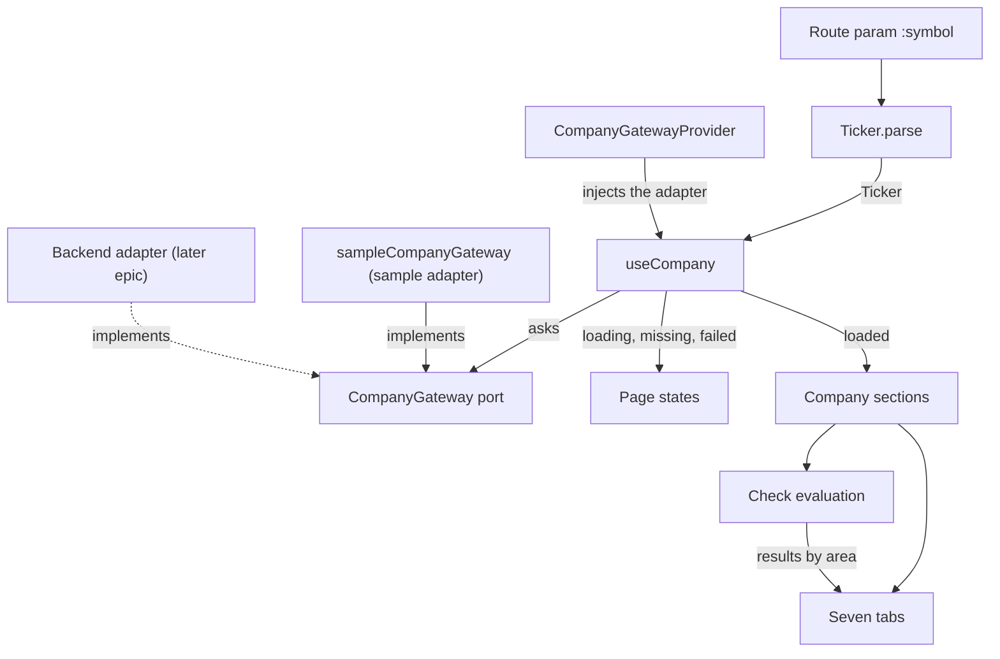

# Iron Capital — Design Language

This document describes the design language of the Iron Capital frontend — its
intent first, and how that intent shows up in the code. It is a companion to
[AGENTS.md](./AGENTS.md): where AGENTS.md covers **how to build** layouts (Grid
vs. Flexbox, spacing, responsive methodology), this document covers **what the
product should feel like** and how typography, color, shape, and motion carry
that feeling.

The single source of truth for the tokens is
[`src/index.css`](./src/index.css). If you change a token there, update this
document in the same pass.

> **Status: draft.** The product is early and nothing here is set in stone.
> This is the north star for taste and consistency, not a frozen spec — when a
> decision serves the character below better than what's written, make it and
> update this doc.

---

## 1. Character — the dual mandate

Iron Capital is **timeless classics, reinterpreted for a modern age.** The whole
design language lives in the tension between two poles held in balance — never
one at the expense of the other.

**The classical pole — timeless.** The brand mark is a Greek temple: a few clean
columns, black on white. It is deliberate. It stands for the root of Western
civilization and the enduring standard of _timeless beauty, timeless standards_.
It also stands for the enduring virtues of the craft we practice: traditional
value investing — fiduciary duty, sound judgment, patience, "handshake-quality"
trust, understanding a business deeply before acting. This pole gives us
authority, restraint, and calm. Serif display type, black-on-white, generous
reading measures, quiet surfaces.

**The modern pole — of its time.** We are not a museum. Under the hood the
product is genuinely modern: a fast frontend, a modern backend, and fast
workflows. The surface should feel that way too — quick, crisp, intuitive,
elegant, alive. This is where the small sparks of modernity live: the flowing
gradient around the search bar, tactile feedback, precise motion, an app that
responds instantly.

**The synthesis.** Don't pick a side. A purely traditional design would read as a
legacy institution; a purely modern one would read as just another
machine-learning startup with no principles underneath. Iron Capital is the
**best of both**: the timeless values of great investing, expressed through a
modern, trustworthy, elegant product. Classical foundation, modern spark.

Guiding adjectives: **timeless, modern, trustworthy, elegant, precise,
intuitive — classical at the root, modern in the execution.** The feeling to
evoke in the viewer is **trust, class, and competence.**

Practical rule of thumb: **classical carries our _voice and values_; modern
carries our _product and machinery_.** When the app is speaking about who we are
and what we believe (the About page, the masthead, statements of principle),
lean classical. When the app is doing work for the user (screener, search,
data, controls), lean modern. The two meet on every page — a serif title above a
crisp, fast tool.

---

## 2. Typography

Type is where the dual mandate is most visible: the **serif faces carry the
classical voice**, the **sans carries the modern product**. Four font roles are
defined as theme tokens in `@theme inline` and consumed through Tailwind
utilities (`font-serif`, `font-sans-serif`, `font-monospace`, `font-classic`).

| Token               | Stack (first choice)         | Pole      | Role                                                       |
| ------------------- | ---------------------------- | --------- | ---------------------------------------------------------- |
| `--font-classic`    | Playfair Display, Cormorant  | Classical | **Signature display face — our voice.** Hero statements of principle, brand titles. |
| `--font-serif`      | Times New Roman, Georgia     | Classical | Default heading face (`h1`–`h3` in the base layer).        |
| `--font-sans-serif` | Inter Variable               | Modern    | Body copy, UI text, controls, tables — the working product. |
| `--font-monospace`  | Roboto Mono Variable         | Modern    | Numeric/tabular data and code — precision and machinery.   |

`--font-cursive` and `--font-fantasy` are defined but reserved for rare
decorative use; they map to system fonts and are **not** part of the everyday
palette.

The variable webfonts (Inter, Playfair Display, Cormorant, Roboto Mono) are
loaded via `@fontsource-variable/*` imports at the top of `src/index.css`.

### Usage rules

- **Playfair Display (`font-classic`) is the brand voice — use it when we speak
  about who we are and what we believe.** This is the classical pole doing its
  job: statements of principle and values. It is used most deliberately on the
  About page (our philosophy and method) and belongs on hero statements and
  section headings across About, Privacy, Sitemap, Contact, and Login. Example
  from `AboutPage.tsx`:
  `className="font-classic text-5xl md:text-7xl font-medium leading-tight"`.
  Reserve it for voice — don't sprinkle it on working UI, where it dilutes the
  contrast that makes the classical moments feel significant.
- **The base layer** already sets `h1`→`font-serif text-36`, `h2`→`text-24`,
  `h3`→`text-18`, so plain headings render as classical serif without extra
  classes. Add `font-classic` when you want the Playfair display voice instead.
- **Body paragraphs** (`<p>`) are justified, capped at `65ch` measure with
  `line-height: 1.6` — a deliberate print-like reading column. Do not remove the
  measure cap on running prose.
- **Numbers and tickers** in the screener/tables should use `font-monospace`
  for column alignment.

### Type scales

Two scales coexist as tokens:

- A **semantic scale** (`text-xs` … `text-5xl`) tuned _small_ for dense data
  UI — note `text-base` is `12px`, not the usual `16px`.
- A **classic point-based scale** (`text-8` … `text-72`, 1pt ≈ 1px) for
  editorial layouts where explicit sizes read better than semantic steps.
  `text-18` is the effective body size; `text-36`/`text-24` are the heading
  sizes wired into the base layer.

---

## 3. Color

The color story is the same balance: a **black-on-white classical base** (the
temple mark, the reading surface) with a **single modern accent** used as a
spark. The base is what makes the product feel timeless and trustworthy; the
accent is what makes it feel alive and current. Restraint is what keeps the
accent meaningful — the more sparingly it appears, the more modern and
intentional it reads.

Colors are defined as CSS custom properties in `oklch()` and exposed to Tailwind
as `--color-*` theme tokens. **Always style with the semantic tokens**
(`bg-background`, `text-foreground`, `text-muted-foreground`, `border-border`,
`bg-primary`, …) — never hard-code hex or raw `oklch()` in components, so that
light/dark theming keeps working.

| Semantic token          | Role                                                   |
| ----------------------- | ------------------------------------------------------ |
| `background`/`foreground` | Page surface and primary ink.                        |
| `primary`               | Brand accent — a blue-violet (hue ≈ 264).              |
| `secondary` / `muted`   | Quiet surfaces and secondary text.                     |
| `accent`                | Subtle hover/active fills.                             |
| `destructive`           | Errors and dangerous actions (red).                    |
| `positive` / `negative` | Gains and losses in data. Not for UI state.            |
| `border` / `input` / `ring` | Hairlines, field borders, focus rings.             |
| `chart-1` … `chart-5`   | Data-visualization series (blue-violet ramp).          |
| `sidebar-*`             | Sidebar-specific surface/accent variants.              |

`bg-input-opaque` paints the `input` fill as an opaque layer over the page
background. Use it where an `input` surface sits on top of another fill, such
as the rejected side of a slider that fills to its end. The dark `--input` is
translucent, so plain `bg-input` there shows the fill underneath. It assumes
the page background behind it, so on a card or popover surface it does not
match.

### Theming

- Dark mode is class-based: the `.dark` class on an ancestor swaps the token
  values, driven by the `@custom-variant dark (&:is(.dark *))` declaration.
- The palette is intentionally **low-chroma and restrained** — accent color is
  used sparingly for emphasis, not decoration. Treat the accent as the modern
  spark against the classical base: a little goes a long way.

---

## 4. Shape & elevation

- **Radius** is driven by a single `--radius` base (`0.625rem`) with a derived
  scale (`--radius-sm` … `--radius-4xl`). Prefer the `rounded-*` utilities that
  map to these over ad-hoc pixel radii.
- **Elevation is quiet.** Separation comes primarily from hairline `border`
  tokens; shadows are reserved for genuinely floating surfaces (dialogs,
  popovers). Avoid heavy drop shadows on inline content.

---

## 5. Motion & interaction

Motion is **the modern pole's clearest voice.** A static page can look
classical on its own; it's response and movement that make the product feel
contemporary, fast, and alive — the visible edge of the modern machinery
underneath. The signature example is the flowing gradient around the
`SearchBar`: a small, elegant spark of modernity against an otherwise calm,
classical surface. That is the template for motion here — restrained,
purposeful, never decorative for its own sake. The named utilities live in
`src/index.css`:

| Utility                 | Purpose                                                              |
| ----------------------- | ------------------------------------------------------------------- |
| `.btn-tactile`          | Buttons lift on hover and depress on active — the house feedback.   |
| `.animate-shake-invalid`| Horizontal shake on invalid form input.                             |
| `.animate-gradient-flow`| Flowing gradient (the `SearchBar` glow border) — the signature spark.|
| `.mobile-menu`          | `grid-template-rows` collapse for the mobile nav.                   |

Follow the collapse/expand and mobile-nav conventions in AGENTS.md — animate
height via `grid-template-rows` (`0fr` → `1fr`), never `display` toggles or the
`max-height` trick.

> **Exploratory, not canonical:** `.animate-glow-once` and the `.glow-nav*`
> utilities (the `GlowNavBar`) were brought in to explore an effect and do **not**
> represent the current design language — the heavy "glow" look pulls toward the
> generic-startup pole, away from the classical restraint we hold. Treat them as
> experiments pending a decision, not house style; the `SearchBar` gradient is
> the one canonical modern spark. Don't reach for glow effects in new UI without
> running it through the design skill's reconcile-or-evolve check.

---

## 6. Components

Reusable primitives live in [`src/components/ui`](./src/components/ui) and are
built on **shadcn** + **@base-ui**, styled with Tailwind and
`class-variance-authority` variant files (e.g. `button/variants.ts`). Every
primitive ships a `*.stories.tsx` file — **Storybook is the living catalog** of
the design system:

```bash
npm run storybook
```

When building UI, compose these primitives rather than restyling raw elements,
and add a story for anything new.

### Atomic and composite components

Design at the right level of the tree. A component is either:

- **Atomic (primitive)** — it can't be broken down further (a button, an input,
  a badge). It stands alone in `ui/` and takes flexible props so any parent can
  arrange it.
- **Composite** — it arranges other components into something more
  coarse-grained (a search bar, a header). A **page is simply the largest
  composite**: a whole tree of sub-components.

Two consequences shape everything we build:

1. **Keep components flexible.** A component earns its place by being reusable
   beyond the one spot it was first needed. Give it the props that let a parent
   compose it, or that let a more specialized component narrow it (a
   specialization is just a composite that wraps and constrains a more generic
   component). Rigid, single-use components don't compose.
2. **Build composites bottom-up.** Decompose a composite into the smallest
   reusable sub-components its design implies; reuse what the catalog already
   has; build what's missing as its own atomic-or-composite component (with its
   own stories and tests), guided by the top-level design; then assemble upward.

The `design` skill walks this decomposition; the `component-scaffold` skill
generates each new piece with its full file set.

---

## 7. The Screener

> **Target state.** This section records the approved screener redesign
> (Linear epic P-STA-8). The shipped page reaches it through the PR stack that
> starts at STA-199. Audit the live page against this section once that stack
> lands.

The screener is the product's main working surface, so the modern pole leads.
The masthead title is the one classical moment on the page. The company
preview repeats it once: the company's name is its serif title, because the
sheet speaks about one company as a whole. The reference
mockup is the
[screener design canvas](https://claude.ai/artifact/8YXQqfS71dsioyMn4jvXfr).

The page has these regions, from top to bottom:

1. **Masthead.** "The Screener" in `font-classic`, one line of muted copy, and
   the `SearchBar`.
2. **Strategy presets.** One row of pill buttons. The active preset is inverted
   (`bg-foreground text-background`), not accented.
3. **Filter rail and results.** On a desktop (1024 px and wider), a 256 px
   filter rail sits left of the results. Below 1024 px, the rail moves into a
   sheet behind a "Filters" button.
4. **Results.** A count and removable filter chips, a strip of medians for the
   result set, then the table. Below 768 px, the table becomes a list of cards.
5. **Company preview.** A side sheet that opens on a selected row.

Rules for the screener:

- **The accent appears in one place.** The selected part of each filter
  histogram uses `chart-3`. The selected row carries a thin accent mark. Nothing
  else on the page is accented.
- **Numbers are mono and right-aligned.** A missing value is a dimmed `—`.
- **Gains and losses use `positive` and `negative`.** A flat value (0.0%) is
  neutral. Never use raw Tailwind colors such as `emerald-500`. This rule is
  documentation only for now, because the `SearchBar` gradient still uses raw
  colors. STA-210 migrates it and adds a CI gate.
- **Flags are outlined, not colored.** A marker such as "Near Low" uses the
  outline badge in `foreground` ink. It stands out by its border, and the
  accent stays reserved for the histograms.
- **Hairlines separate, shadows float.** The table and the summary strip sit in
  bordered frames. Only the preview sheet casts a shadow.
- **Column groups carry meaning.** The table groups its columns under
  Valuation, Balance sheet, Shareholder yield, and Price.

---

## 8. The Company Page

> **Target state.** This section records the decided rules for the company
> page (Linear epic P-STA-10 "Company Page"). The per-tab layout waits for
> the revised mockup and its approval. The ticket STA-221 then adds that
> layout here. The current mockup is the
> [company page design canvas](https://claude.ai/artifact/CwP59tuPZtXasw8dg7vpco).

The company page is part of the product machinery, so the modern pole leads.
The company name in the masthead is in `font-classic`, like the name in the
screener's company preview. The name speaks about the company as a whole, so it
takes the classical voice. The section titles are serif and numbered, such as
"4.1 Financial Position Analysis".

Overview is the landing tab. Each of the seven tabs has its own URL:

| Tab                 | URL                                |
| ------------------- | ---------------------------------- |
| Overview            | `/companies/:symbol`               |
| Financials          | `/companies/:symbol/financials`    |
| Valuation           | `/companies/:symbol/valuation`     |
| Shareholder returns | `/companies/:symbol/returns`       |
| Relationships       | `/companies/:symbol/relationships` |
| Management          | `/companies/:symbol/management`    |
| Filings             | `/companies/:symbol/filings`       |

The "Open company page" link in the screener's company preview opens Overview.
On a phone, the tab strip scrolls sideways.

Rules for the company page:

- **Fundamentals only.** The page shows past facts from filings. It never shows
  news, forecasts, analyst ratings, price targets, a fair value, community
  content, insider-sale alerts, or buy and sell calls. The page never presents
  one figure as the answer, such as "25.5% undervalued".
- **Figures are mono.** In a table column, figures are right-aligned. A missing
  figure is a dimmed `—`.
- **Every figure carries a source reference or a formula.** For a reported
  figure, the source reference names the filing type, filing date, line label,
  and XBRL tag. It also links to the filing. A derived figure, such as a margin
  or a growth rate, shows its formula.
- **Every chart has a "Data" button.** The button shows the same figures as a
  table.
- **Charts draw yearly data as bars or steps, never as smoothed curves.** Chart
  series use the `chart-1` … `chart-5` tokens.
- **The page groups its checks in five areas.** The areas are Balance sheet,
  Profitability, Valuation, Shareholder returns, and Consistency. Each area has
  an icon and a small ring that counts its met checks. There is no overall
  score and no snowflake chart.
- **A check shows its evidence.** Each check states its rule with the
  threshold, the company's figure, and the source. The figure sits inside the
  sentence, such as "Short-term assets ($197.4B) exceed short-term liabilities
  ($43.0B)". Each check has one of three results: met, not met, or not enough
  data.
- **A check name carries no verdict.** The name states the rule and never
  judges the company. The page never shows a name such as "Notable Dividend"
  next to a red cross.
- **Export is a print stylesheet and CSV.** The print stylesheet formats the
  Overview tab as a one-page summary on A4 and Letter paper, in the Value Line
  style. The user saves the summary through the browser's "Save as PDF" option.
  Each financial statement table downloads as CSV. There is no server-side PDF.

The page reads its data through the `CompanyGateway` port (AGENTS.md
"Dependency Injection & Ports"). Until the backend adapter exists in a later
epic, a sample adapter serves made-up data for Meridian Semiconductor (MRDN).
`CompanyGatewayProvider` injects the adapter into `useCompany`. For a `Ticker`,
`useCompany` returns a loading, loaded, missing, or failed state.



---

## 9. Quick reference for contributors

- **Hold the dual mandate:** classical foundation, modern spark. Ask of any
  screen — does it feel _timeless AND modern, trustworthy AND elegant_? If it's
  drifted to a legacy institution or to a generic ML startup, rebalance.
- **Classical carries voice/values; modern carries product/machinery.** Serif
  and black-on-white when we speak about who we are; crisp sans, fast motion,
  and the accent spark when the user is doing work.
- Style with **semantic tokens**, never raw colors — keep dark mode working.
- **Playfair (`font-classic`)** for statements of principle and brand display;
  serif base headings otherwise; **Inter** for UI; **Roboto Mono** for numbers.
- Keep running prose in a **justified, `65ch`, 1.6-leading** column.
- Buttons get **`.btn-tactile`**; animate height with **`grid-template-rows`**.
- Reach for a **shadcn/ui primitive** first; add a **Storybook story** for new
  ones.
- Change a token in `src/index.css` → update this document in the same commit.
