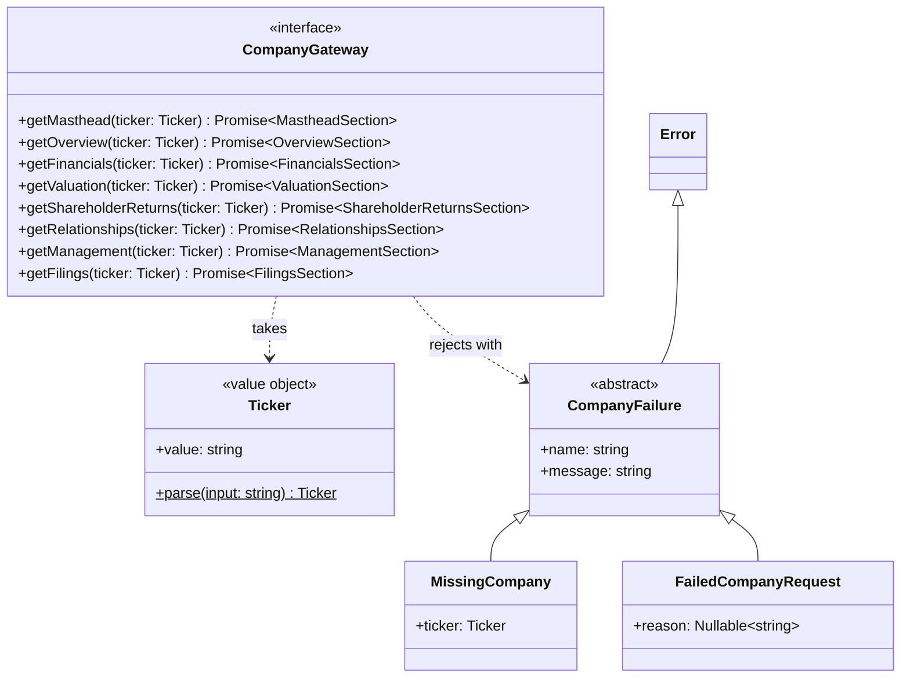
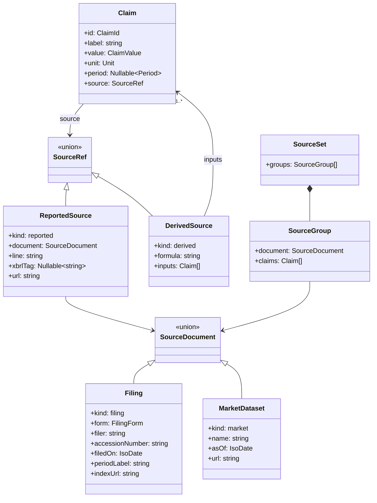
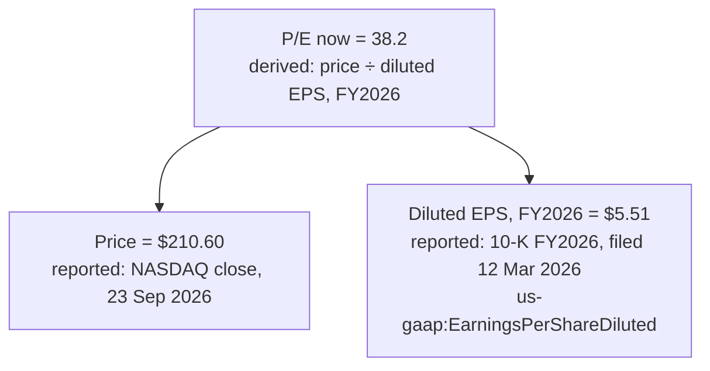
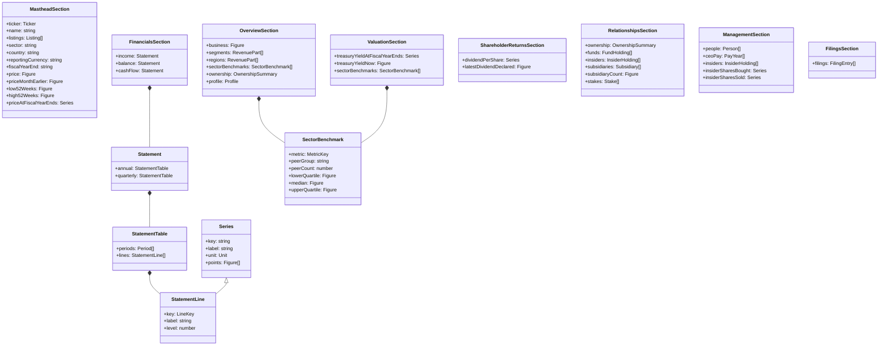
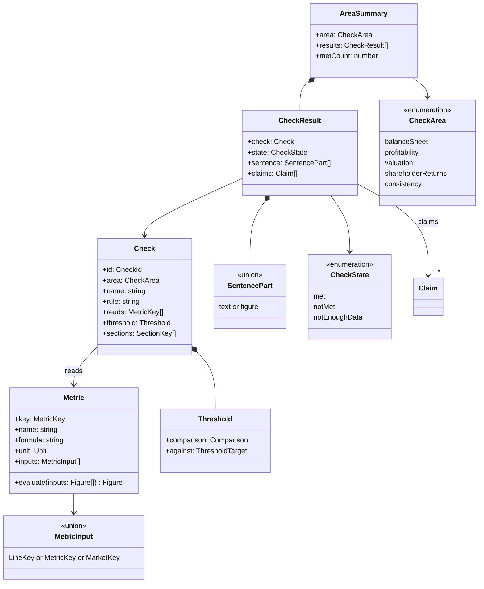

# Company Data Model

This note fixes the types behind the company page at `/companies/:symbol`
(Linear epic P-STA-10, ticket STA-222). STA-224 writes the port, the section
types and the claim types. STA-226 writes the metrics, the source collection
and the check evaluation. STA-227 fills the sample adapter with the Meridian
Semiconductor (MRDN) data. `DESIGN.md` §8 holds the page rules that this model
serves.

## 1. Terms

- A **port** is an interface that the app owns (`AGENTS.md` "Dependency
  Injection & Ports").
- A **section** is the data that one part of the page needs, such as the
  masthead or one tab.
- A **claim** is one figure on the page, with its value, its unit and its
  source. A table cell, a chart point and a figure inside a check sentence are
  each one claim.
- A **source reference** (`SourceRef`) tells where a claim comes from. A
  reported source names one line in one document. A derived source gives a
  formula and the input claims.
- A **metric** is a defined figure with a name, a formula, a unit and its
  inputs.
- A **check** is a rule over metrics with a visible threshold.

## 2. The `CompanyGateway` port

The port has one method per section. Each method takes a `Ticker` and returns
the section as a promise.

**Why one method per section.** Each tab loads only its own data. A later
milestone adds a method and leaves the existing methods unchanged. A named
fake can fail one section and serve the others, so a test can draw a tab that
fails while the masthead loads.

**How a method reports an error.** A method rejects its promise with a
`CompanyFailure`. It never returns a result object like `AuthOutcome`.
`AuthOutcome` fits a mutation, where a failure is an expected answer to the
user. A section read either returns the section or fails. `useCompany` catches
the rejection and maps it to a page state:

| Error                  | When                                        | Page state | Message                                                                    |
| ---------------------- | ------------------------------------------- | ---------- | -------------------------------------------------------------------------- |
| `MissingCompany`       | The adapter knows no company for the ticker | missing    | `[MissingCompany] No company has this ticker, Reason: 'XYZ'`               |
| `FailedCompanyRequest` | The load did not complete                   | failed     | `[FailedCompanyRequest] The company request did not complete`        |

`getMasthead` decides the missing state, because every tab loads it. STA-224
writes the errors in `src/lib/company/errors.ts`, on the model of
`src/lib/auth/errors.ts`.

## 3. Claims and source references

`Nullable~T~` in the diagrams means `T | null`. `Figure` means `Claim | null`.
A `null` figure is a missing figure. The page draws it as a dimmed `—`
(`DESIGN.md` §8). A missing figure has no source, because nothing reported it.

The value types:

- `ClaimValue` is `number | string`. A text claim, such as a subsidiary name or
  a board member's independence, uses the unit `text`.
- `Unit` is one of `usd`, `usdPerShare`, `shares`, `percent`, `ratio`,
  `count`, `year` or `text`. A value is in whole units, for example
  `212000000000` for $212.0B. The page formats it.
- `Period` is one of `fiscalYear` (FY2026), `fiscalQuarter` (Q2 FY2027,
  three months), `yearToDate` (six months to Q2 FY2027), `lastFourQuarters`
  or `instant` (a date, for a balance sheet or a price).
- `ClaimId` is a string that is unique on the page, such as
  `income.revenue.FY2026`. Hover, pin and chart highlight use it.
- `FilingForm` is one of `10-K`, `10-Q`, `8-K`, `DEF 14A`, `Form 4` or
  `13F-HR`.

**A reported claim** has one `ReportedSource`. It holds the filing type
(`document.form`), the filing date (`document.filedOn`), the line label, the
XBRL tag and a link. `line` is the path to the line as the document prints it,
for example `Consolidated statements of income › Revenue`.

**A reported claim without an XBRL tag** has `xbrlTag: null`. Its `line` names
the place in the document, and its `url` opens the exact document inside the
filing, not the filing index:

| Document          | `line` example                                                        | `url` opens              |
| ----------------- | --------------------------------------------------------------------- | ------------------------ |
| 13F-HR            | `Information table › Shares (sshPrnamt)`                              | the information table    |
| Form 4            | `Table I › Amount beneficially owned following reported transactions` | the Form 4 document      |
| 10-K Exhibit 21   | `Exhibit 21 › Meridian Semiconductor GmbH`                            | the Exhibit 21 document  |
| DEF 14A           | `Summary compensation table › Salary`                                 | the proxy statement      |
| End-of-day prices | `Closing price, NASDAQ`                                               | the price history        |

A price and a Treasury yield are reported claims too. Their document is a
`MarketDataset` instead of a `Filing`.

**A derived claim** has one `DerivedSource`. It holds the formula as text and
one input claim for each term of the formula. Each input is a claim with its
own source, so the sources form a small tree. Every branch ends in a reported
source. This example is the P/E now:

**How a chart or table collects its sources.** STA-226 writes two pure
functions in `src/lib/company/sources.ts`:

- `claimsOf(block)` returns every claim that a chart, table or check draws.
- `sourcesOf(claims: Claim[]): SourceSet` walks each tree down to its reported
  sources. It groups the reported claims by document, with one group per
  filing or dataset. It sorts filings newest first and puts market data last.

The "Sources" chip of a chart or table shows `sourcesOf(claimsOf(block))`.
The per-tab sources index is `sourcesOf` over every claim on the tab. No
section stores a source set, so the set can never disagree with its claims.

## 4. Sections

Each tab loads the masthead and the sections in its row.

| Page part           | Section type                | Port method             | The tab also reads          |
| ------------------- | --------------------------- | ----------------------- | --------------------------- |
| Masthead            | `MastheadSection`           | `getMasthead`           | none                        |
| Overview            | `OverviewSection`           | `getOverview`           | Financials, Valuation       |
| Financials          | `FinancialsSection`         | `getFinancials`         | none                        |
| Valuation           | `ValuationSection`          | `getValuation`          | Financials                  |
| Shareholder returns | `ShareholderReturnsSection` | `getShareholderReturns` | Financials                  |
| Relationships       | `RelationshipsSection`      | `getRelationships`      | none                        |
| Management          | `ManagementSection`         | `getManagement`         | none                        |
| Filings             | `FilingsSection`            | `getFilings`            | none                        |

The Overview tab reads Financials for "Ten Years at a Glance", the key figures
and the financial position. It reads Valuation for one check. Until
`getValuation` exists, that check shows "not enough data".

`Series.points` holds one `Figure` for each period of its table or chart, in
the same order. A `string` field names a row or a label, such as a fund name
or a sector. It is not a figure. Every figure is a `Figure`, so every figure
carries a `SourceRef`. The smaller types:

| Type               | Fields                                                                                                     |
| ------------------ | ---------------------------------------------------------------------------------------------------------- |
| `Listing`          | `exchange: string`, `symbol: string`                                                                       |
| `RevenuePart`      | `name: string`, `revenue: Figure`                                                                          |
| `OwnershipSummary` | `asOf: IsoDate`, `sharesOutstanding: Figure`, `institutionShares: Figure`, `insiderShares: Figure`         |
| `Profile`          | `founded`, `headquarters`, `employees`, `chiefExecutive`, `chiefExecutiveSince`, `auditor`, `website`, each a `Figure` |
| `FundHolding`      | `fund: string`, `shares: Figure`, `sharesQuarterEarlier: Figure`                                           |
| `InsiderHolding`   | `name: string`, `role: string`, `shares: Figure`                                                           |
| `Subsidiary`       | `name: Figure`, `jurisdiction: Figure`                                                                     |
| `Stake`            | `company: string`, `ticker: Nullable<Ticker>`, `sharesHeld: Figure`, `sharesOutstanding: Figure`           |
| `Person`           | `name: string`, `role: string`, `isDirector: boolean`, `since: Figure`, `independence: Figure`            |
| `PayYear`          | `fiscalYear: number`, `salary`, `bonus`, `stockAwards`, `other`, each a `Figure`                           |
| `FilingEntry`      | `filing: Filing`, `feeds: FigureGroupRef[]`                                                                |
| `FigureGroupRef`   | `tab: TabKey`, `label: string`, for example Financials, "Income statement, ten years"                      |

The three statements each hold an annual table of ten fiscal years and a
quarterly table of the last eight fiscal quarters. `LineKey` names each
reported line, such as `revenue`, `dilutedEps`, `totalCurrentAssets`,
`operatingCashFlow` or `dividendsPaid`.

**What the port returns and what `metrics.ts` derives.** The port returns
every reported figure. It also returns the derived figures whose inputs are in
no section. `src/lib/company/metrics.ts` derives every other figure from the
sections.

| The port returns                                                                                                                         | `metrics.ts` derives                                                                                                                                                                                         |
| ---------------------------------------------------------------------------------------------------------------------------------------- | ------------------------------------------------------------------------------------------------------------------------------------------------------------------------------------------------------------ |
| Statement lines, prices, Treasury yields, dividends per share, holdings, pay, people, subsidiaries, filings                              | Margins, free cash flow, growth a year, market cap, P/E, P/FCF, P/B, EV/EBIT, yields, payout, net buybacks, total shareholder yield, ranges and medians over ten years |
| Sector quartiles and medians (inputs: each peer's figure)                                                                               | Fourth-quarter and three-month cash flow figures, sums over the last four quarters                                                                                                                           |
| Institution totals over all 13F filers, insider shares bought and sold per year (inputs: each 13F or Form 4 figure)                      | Price change over one month, ownership shares, stake percentages, pay mix, tenure                                                                                                                            |

No section type holds news, forecasts, analyst ratings, price targets, a fair
value or community content. Every field is a past fact from a filing or a
market dataset.

## 5. Metrics, checks and results

- `Metric.evaluate` turns its input claims into one `Figure`. The figure has a
  `DerivedSource` with the metric's formula and the input claims. If an input
  is `null`, the result is `null`.
- A `MetricInput` is a statement line (`LineKey`), another metric
  (`MetricKey`) or a market figure (`MarketKey`: `price` or
  `treasuryYield10y`).
- A `Threshold` compares a metric with a fixed value (`1.5`), with another
  metric (total debt), or with a count (8 of 10 years). `Comparison` is one of
  `above`, `atLeast`, `below` or `atMost`.
- A `SentencePart` is either text or a figure. A figure part holds a `Figure`,
  so a missing input draws a dimmed `—` inside the sentence.
- `CheckResult.claims` lists the claims of every figure in the sentence. The
  quiet source line under the sentence is `sourcesOf(claims)`.
- `evaluateChecks(sections)` in `src/lib/company/checks.ts` returns one
  `AreaSummary` for each area, in the order of `CheckArea`. The result is
  "not enough data" when a section is absent or an input is `null`.
- No type has an overall score. The page never adds the met counts together.

## 6. The first check set

The mock-up has seven checks. Each area needs two to four checks, so this set
adds four: return on equity, free cash flow yield against the Treasury,
dividends within free cash flow, and positive net income.

| #   | Area                | Name                                                    | Rule and threshold                             | Metrics it reads                                   | Sections                        |
| --- | ------------------- | ------------------------------------------------------- | ---------------------------------------------- | -------------------------------------------------- | ------------------------------- |
| B1  | Balance sheet       | Cash and short-term investments above total debt       | `cashAndShortTermInvestments` > `totalDebt`    | `cashAndShortTermInvestments`, `totalDebt`         | Financials                      |
| B2  | Balance sheet       | Current ratio of at least 1.5                           | `currentRatio` ≥ 1.5                           | `currentRatio`                                     | Financials                      |
| P1  | Profitability       | Stock-based pay below 5% of revenue                     | `stockPayToRevenue` < 5%                       | `stockPayToRevenue`                                | Financials                      |
| P2  | Profitability       | Return on equity of at least 15%                        | `returnOnEquity` ≥ 15%                         | `returnOnEquity`                                   | Financials                      |
| V1  | Valuation           | P/E below its own 10-year median                        | `priceToEarnings` < `priceToEarningsMedian10y` | `priceToEarnings`, `priceToEarningsMedian10y`      | Masthead, Financials            |
| V2  | Valuation           | Free cash flow yield above the 10-year Treasury yield   | `freeCashFlowYield` > `treasuryYield10y`       | `freeCashFlowYield`, `treasuryYield10y`            | Masthead, Financials, Valuation |
| S1  | Shareholder returns | Fewer diluted shares than five years ago                | `dilutedShares` FY < `dilutedShares` FY−5      | `dilutedShares`                                    | Financials                      |
| S2  | Shareholder returns | Dividend yield of at least 2%                           | `dividendYield` ≥ 2%                           | `dividendYield`                                    | Masthead, Financials            |
| S3  | Shareholder returns | Dividends paid within free cash flow                    | `dividendsToFreeCashFlow` ≤ 100%               | `dividendsToFreeCashFlow`                          | Financials                      |
| C1  | Consistency         | Free cash flow positive in at least 8 of 10 years       | `yearsWithPositiveFreeCashFlow` ≥ 8            | `yearsWithPositiveFreeCashFlow`                    | Financials                      |
| C2  | Consistency         | Net income positive in at least 8 of 10 years           | `yearsWithPositiveNetIncome` ≥ 8               | `yearsWithPositiveNetIncome`                       | Financials                      |

Each name states the rule. No name judges the company. S1 compares fiscal
years, not quarters as the mock-up did, so both figures come from the annual
table. S2 uses dividends paid over the last four quarters instead of the
dividend per share, so the check needs only the Financials section.

**Checks that wait for a later milestone.** STA-224 writes the masthead, the
Overview and the Financials sections. V2 reads `treasuryYield10y` from the
Valuation section. Until the "Valuation and Shareholder Returns Tabs"
milestone adds `getValuation`, the result of V2 is "not enough data". Every
other check has its inputs after the Financials Tab milestone.

The metrics that the checks read:

| Metric                          | Formula                                                                       | Unit    |
| ------------------------------- | ----------------------------------------------------------------------------- | ------- |
| `cashAndShortTermInvestments`   | Reported line, latest quarter end                                             | usd     |
| `totalDebt`                     | Short-term debt + long-term debt, latest quarter end                          | usd     |
| `currentRatio`                  | Total current assets ÷ total current liabilities, latest quarter end          | ratio   |
| `stockPayToRevenue`             | Share-based compensation ÷ revenue, latest fiscal year                        | percent |
| `returnOnEquity`                | Net income, latest fiscal year ÷ shareholders' equity, latest quarter end     | percent |
| `marketCap`                     | Price × diluted shares, latest quarter                                        | usd     |
| `priceToEarnings`               | Price ÷ diluted EPS, latest fiscal year                                       | ratio   |
| `priceToEarningsMedian10y`      | Median of (price at fiscal year end ÷ diluted EPS) over the last 10 years     | ratio   |
| `freeCashFlow`                  | Operating cash flow − capital expenditure, per period                         | usd     |
| `freeCashFlowYield`             | Free cash flow, latest fiscal year ÷ `marketCap`                              | percent |
| `treasuryYield10y`              | Reported 10-year par yield, U.S. Treasury, latest close                       | percent |
| `dilutedShares`                 | Reported weighted average diluted shares, per fiscal year                     | shares  |
| `dividendYield`                 | Dividends paid, last four quarters ÷ `marketCap`                              | percent |
| `dividendsToFreeCashFlow`       | Dividends paid ÷ free cash flow, latest fiscal year                           | percent |
| `yearsWithPositiveFreeCashFlow` | Count of the last 10 fiscal years with free cash flow above zero              | count   |
| `yearsWithPositiveNetIncome`    | Count of the last 10 fiscal years with net income above zero                  | count   |

## 7. Open questions from the epic fog log

**Do sector medians and quartiles come from the company sections or from a
separate sector port?** Settled: from the company sections. `OverviewSection`
and `ValuationSection` each carry `SectorBenchmark` values. The peer group
depends on the company, so the figures belong to the company's data. Each
quartile and median is a derived claim with one input claim for each peer. The
source card lists the first ten inputs and counts the rest. A later backend
adapter can read a sector service behind the port, and the section types stay
the same. This note adds no sector port, so the epic needs no new ticket.

**How does a source reference link to the exact line on SEC EDGAR?** Settled
for the first version, with one part open. `ReportedSource.url` opens the exact
document in the filing: the primary document through the EDGAR Inline XBRL
viewer, or the exhibit, information table or Form 4 itself.
`Filing.accessionNumber` names the filing, and `indexUrl` opens its index.
The source card shows `line` and `xbrlTag`, and the reader finds the line with
the viewer's search. Open: a link that jumps to the one fact inside the
document. EDGAR has no stable anchor for one fact. The backend epic decides if
it stores fact ids. A later field on `ReportedSource` can then carry the id,
and no other type changes.

**Which statements have quarterly and trailing-twelve-month figures, and how
does the page label them?** Settled:

- All three statements have annual and quarterly tables.
- Income statement: a 10-Q reports three months for Q1 to Q3. `metrics.ts`
  derives Q4 as the fiscal year minus Q1 to Q3.
- Cash flow statement: a 10-Q reports year to date. `metrics.ts` derives each
  quarter as the difference of two year-to-date figures.
- Balance sheet: each figure is at a quarter end. It has no sum over four
  quarters. The annual view adds a column for the latest quarter end, such as
  "26 Jul 2026".
- The income and cash flow statements have a sum over the last four quarters.
  `metrics.ts` derives it with the four quarterly claims as inputs. The page
  labels the column "Last 4 quarters" with the end date under it, such as
  "to 26 Jul 2026". The page does not print the abbreviation "TTM".
