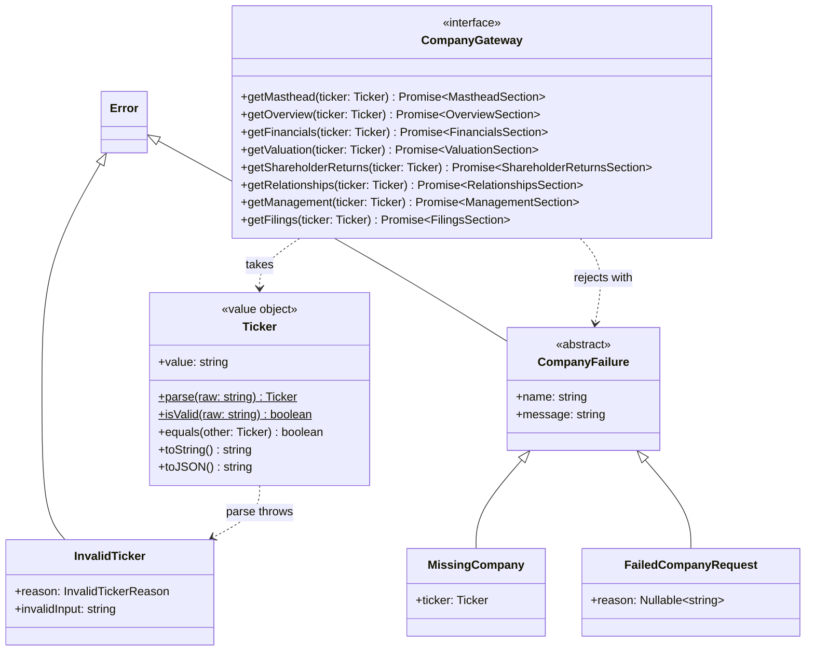
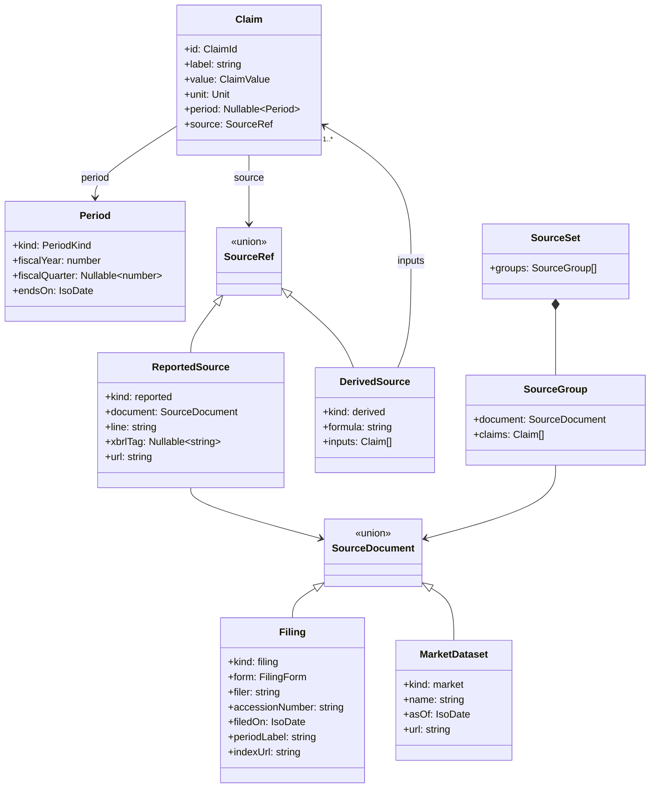
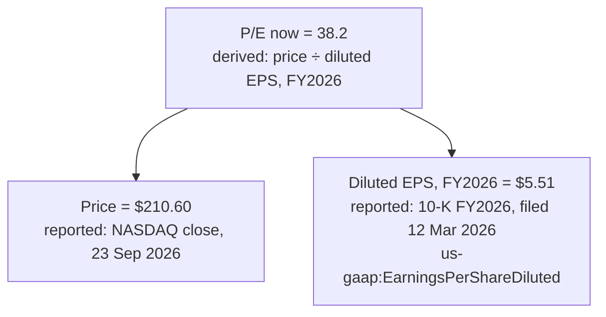
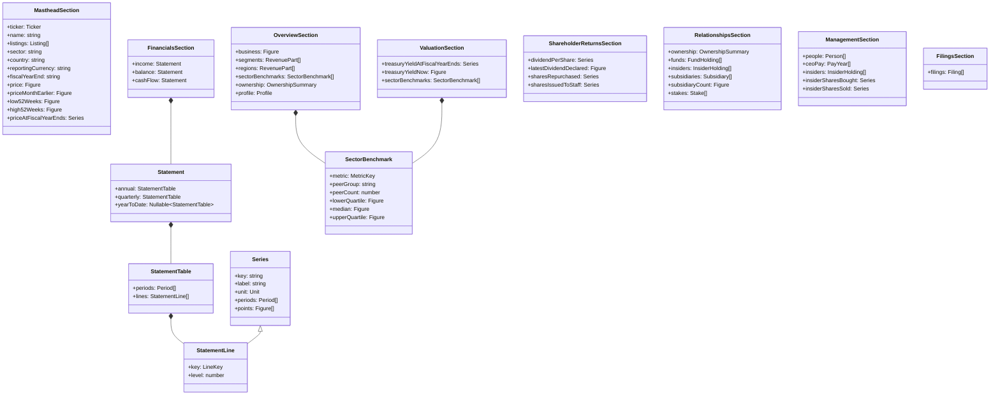
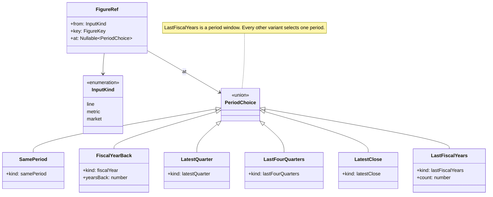
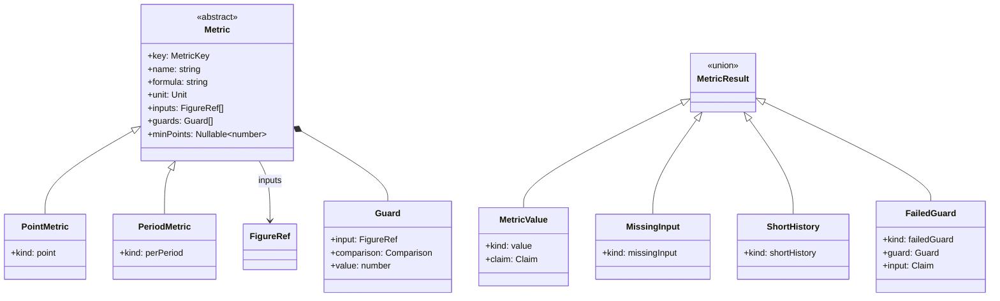
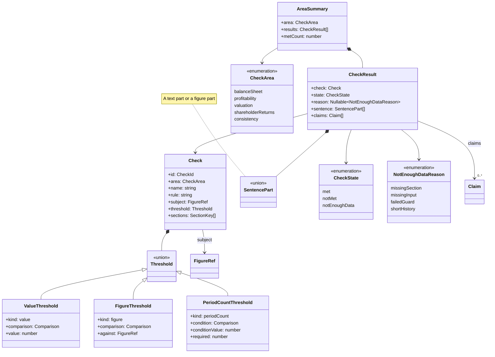

# Company Data Model

This note fixes the types behind the company page at `/companies/:symbol`
(Linear epic P-STA-10, ticket STA-222). STA-224 writes the port, the section
types and the claim types. STA-226 writes the metrics, the source collection
and the check evaluation. STA-227 fills the sample adapter with the Meridian
Semiconductor (MRDN) data. `DESIGN.md` §8 holds the page rules that this model
serves.

**Reading guide.** The note is long, so each ticket can read only its parts.

| Section                                   | What it fixes                                                      | Read it for      |
| ----------------------------------------- | ------------------------------------------------------------------ | ---------------- |
| [1. Terms](#1-terms)                      | The words the note uses                                            | every ticket     |
| [2. The port](#2-the-companygateway-port) | `CompanyGateway`, `Ticker`, the errors and the page states         | STA-224          |
| [3. Claims](#3-claims-periods-and-source-references) | `Claim`, `Period`, source references, `sourcesOf`, `feedsOf`, figure groups | every ticket |
| [4. Sections](#4-sections)                | The eight section types, the line keys and what the port returns   | STA-224, STA-227 |
| [5. Metrics and checks](#5-metrics-checks-and-results) | Figure references, market keys, per-row derived figures, guards, thresholds, check results | STA-226 |
| [6. The first check set](#6-the-first-check-set) | The 11 checks and the metrics they read                     | STA-226, STA-227 |
| [7. Worked examples](#7-worked-examples)  | S1, C1, V1, three loss-making cases and one Filings row, in the types | STA-224, STA-226 |
| [8. Open questions](#8-open-questions-from-the-epic-fog-log) | The three fog questions from the epic             | every ticket     |
| [9. Enforcement](#9-enforcement-levels)   | Which rules a script can check                                     | STA-224, STA-226 |

## 1. Terms

- A **port** is an interface that the app owns (`AGENTS.md` "Dependency
  Injection & Ports").
- A **section** is the data that one part of the page needs, such as the
  masthead or one tab.
- A **claim** is one figure on the page, with its value, its unit, its period
  and its source. A table cell, a chart point and a figure inside a check
  sentence are each one claim.
- A **period** is the stretch of time or the date that a claim covers, such as
  the fiscal year FY2026 or the quarter end 26 Jul 2026.
- A **source reference** (`SourceRef`) tells where a claim comes from. A
  reported source names one line in one document. A derived source gives a
  formula and the input claims.
- A **metric** is a defined figure with a name, a formula, a unit and its
  inputs.
- A **period selector** names the period of one metric input, such as "the
  latest fiscal year" or "five fiscal years before the latest". A **period
  window** names a run of periods, such as "the last 10 fiscal years".
- A **guard** is a condition on a metric input. If the guard fails, the metric
  has no reading, such as a P/E with negative earnings.
- A **check** is a rule over metrics with a visible threshold.

## 2. The `CompanyGateway` port

The port has one method per section. Each method takes a `Ticker` and returns
the section as a promise.



**`Ticker` is already on `dev`.** It lives in `src/lib/domain/ticker.ts` and
follows `AGENTS.md` "Value Objects", like `Email` in `src/lib/domain/email.ts`.
The diagram above copies its public shape. `Ticker.parse` trims and upper-cases
the input, and it is the only way to get a `Ticker`. On bad input it throws
`InvalidTicker` with one `InvalidTickerReason`: `empty`, `too-long`,
`invalid-character` or `invalid-separator`. The message has the form
`[InvalidTicker] Not a valid ticker, Reason: 'too-long', Input: 'ABCDEFGHIJK'`.
Code compares two tickers with `equals` and never with `===`. For example, the
Relationships tab matches a `Stake` with a company page only when
`stake.ticker` is not `null` and `stake.ticker.equals(pageTicker)` holds.

**Why one method per section.** Each tab loads only the sections that its
row in §4 names. A later milestone adds a method and leaves the existing
methods unchanged. A named fake can fail one section and serve the others,
so a test can draw a tab that fails while the masthead loads.

**How a method reports an error.** A method rejects its promise with a
`CompanyFailure`. It never returns a result object like `AuthOutcome`.
`AuthOutcome` fits a mutation, where a failure is an expected answer to the
user. A section read either returns the section or fails. `useCompany` catches
the rejection and maps it to a page state.

The messages follow `AGENTS.md` "Error Display Format". `CompanyFailure`
renders them the same way as `AuthFailure` in `src/lib/auth/errors.ts`: the
`, Reason: '<detail>'` tail appears only when `reason` holds a value. The
signature matches too. The constructor of `FailedCompanyRequest` takes
`reason?: string`, like `FailedAuthRequest`, so a caller writes
`new FailedCompanyRequest()` without a reason. The field `reason` then holds
`null`. `MissingCompany` has no reason. It names the ticker that the adapter
did not know in an `Input:` tail, as `InvalidTicker` does.

| Error                  | When                                        | Page state | Message                                                                                  |
| ---------------------- | ------------------------------------------- | ---------- | ---------------------------------------------------------------------------------------- |
| `MissingCompany`       | The adapter knows no company for the ticker | missing    | `[MissingCompany] No company has this ticker, Input: 'XYZ'`                              |
| `FailedCompanyRequest` | The load did not complete, `reason` absent  | failed     | `[FailedCompanyRequest] The company request did not complete`                            |
| `FailedCompanyRequest` | The load did not complete, `reason` present | failed     | `[FailedCompanyRequest] The company request did not complete, Reason: 'Network timeout'` |

The description "did not complete" differs from the auth description on
purpose. The auth description uses a modal verb that the `plain-english` skill
replaces.

`getMasthead` decides the missing state, because every tab loads it. Two more
cases have a fixed state:

- If `getMasthead` resolves and a tab method rejects with `MissingCompany`,
  that tab shows the failed state. The masthead proved that the company
  exists, so the tab error is an adapter defect, not a missing company.
- `useCompany` keys each result by ticker and section. If a result arrives for
  a ticker that no longer `equals` the page's ticker, `useCompany` drops it.
  A slow `getOverview` for MRDN therefore never draws on the page of another
  company.

STA-224 writes the errors in `src/lib/company/errors.ts`, on the model of
`src/lib/auth/errors.ts`.

## 3. Claims, periods and source references

`Nullable~T~` means `T | null`, in the diagrams and in the tables. `Figure`
means `Claim | null`.
A `null` figure is a missing figure. The page draws it as a dimmed `—`
(`DESIGN.md` §8). A missing figure has no source, because nothing reported it.



The value types:

- `ClaimValue` is `number | string`. A text claim, such as a subsidiary's
  jurisdiction or a board member's independence, uses the unit `text`.
- `Unit` is one of `usd`, `usdPerShare`, `shares`, `percent`, `ratio`,
  `count`, `year`, `date` or `text`. A value is in whole units, for example
  `212000000000` for $212.0B. A `percent` value is a fraction, for example
  `0.15` for 15%. A `date` value is an `IsoDate`. The page formats it.
- `PeriodKind` is one of `fiscalYear` (FY2026), `fiscalQuarter` (Q2 FY2027,
  three months), `yearToDate` (six months to Q2 FY2027), `lastFourQuarters`
  or `instant` (a date, for a balance sheet or a price).
- `Period.fiscalYear` is the fiscal year that the period falls in.
  `Period.fiscalQuarter` is `1` to `4` for a quarter, a year to date or a
  quarter end. It is `null` for a fiscal year, for the last four quarters and
  for an instant at a fiscal year end. `Period.endsOn` is the last day of the
  period, or the date of an instant.
- `Claim.period` is `null` in two cases. A reported fact with no stated
  period, such as `Profile.website`, has no period. A derived claim whose
  inputs do not share one period has no period either. For example, the P/E
  now reads a price on 23 Sep 2026 and the EPS of FY2026, so its period is
  `null`. A derived claim whose inputs share one period by the rule below
  takes that period. For a fiscal year paired with the instant at its end, it
  takes the fiscal year.
- Two periods are the **same period** when their `kind`, `fiscalYear` and
  `fiscalQuarter` match. The one exception pairs a fiscal year with the
  instant at its end, because a year-end price and a year's EPS belong
  together. §5 uses this rule to pair the inputs of a per-period metric.
- `ClaimId` is a string that is unique on the page. Hover, pin and chart
  highlight use it. Three owners mint ids, each under its own prefix:
  - The port mints `{section}.{key}.{period}`, such as
    `financials.revenue.FY2026`.
  - `metrics.ts` mints `metric.{key}.{period}`, such as
    `metric.freeCashFlow.FY2026`, or `metric.{key}` for a metric with no single
    period, such as `metric.priceToEarningsMedian10y`.
  - `checks.ts` mints `check.{checkId}.{part}`, such as `check.C1.count`.

  The `{period}` part renders the `Period` from its `kind`. The rendering
  keeps the annual, quarterly and last-four-quarters claims of one line apart:

  | `PeriodKind`       | `{period}`          | Example id                                  |
  | ------------------ | ------------------- | ------------------------------------------- |
  | `fiscalYear`       | `FY{fiscalYear}`    | `financials.revenue.FY2026`                 |
  | `fiscalQuarter`    | `Q{q}-FY{year}`     | `financials.revenue.Q2-FY2027`              |
  | `yearToDate`       | `YTD-Q{q}-FY{year}` | `financials.operatingCashFlow.YTD-Q2-FY2027` |
  | `lastFourQuarters` | `L4Q-{endsOn}`      | `metric.revenue.L4Q-2026-07-26`             |
  | `instant`          | `{endsOn}`          | `financials.shareholdersEquity.2026-07-26`  |

  A claim with no period drops the part, such as `overview.profile.website`.
  A figure in a list row puts the list name and the row position before the
  field, such as `relationships.stakes.2.sharesHeld`. A list whose rows are
  fiscal years, such as `ceoPay`, puts the period last instead, such as
  `management.ceoPay.salary.FY2026`. A derived claim from a named function of
  §5 uses the function name as its key, then the row part or the period,
  then a part name if the function gives several parts. Examples are
  `metric.stakePercent.stakes.2`, `metric.netInsiderShares.FY2026`,
  `metric.ownershipShares.public` and `metric.priceChangeOneMonth`.
- `IsoDate` is a calendar date as a string, such as `2026-07-26`. STA-224
  brands the type, so a type test can tell it apart from a plain `string`.
- `FilingForm` is one of `10-K`, `10-Q`, `8-K`, `DEF 14A`, `Form 4` or
  `13F-HR`.

**A reported claim** has one `ReportedSource`. It holds the filing type
(`document.form`), the filing date (`document.filedOn`), the line label, the
XBRL tag and a link. `line` is the path to the line as the document prints it,
for example `Consolidated statements of income › Revenue`. A reported value
keeps the sign of its XBRL fact. For a payment line such as
`capitalExpenditure` or `dividendsPaid`, the XBRL fact is a positive amount,
so the value is positive.

**A reported claim without an XBRL tag** has `xbrlTag: null`. Some documents
report no XBRL fact for the figure. `DESIGN.md` §8 allows this case: the
source reference then names the line alone. Its `line` names the place in the
document, and its `url` opens the exact document inside the filing, not the
filing index:

| Document          | `line` example                                                        | `url` opens              |
| ----------------- | --------------------------------------------------------------------- | ------------------------ |
| 13F-HR            | `Information table › Shares (sshPrnamt)`                              | the information table    |
| Form 4            | `Table I › Amount beneficially owned following reported transactions` | the Form 4 document      |
| 10-K Exhibit 21   | `Exhibit 21 › Meridian Semiconductor GmbH › Jurisdiction`             | the Exhibit 21 document  |
| DEF 14A           | `Summary compensation table › Salary`                                 | the proxy statement      |
| End-of-day prices | `Closing price, NASDAQ`                                               | the price history        |

A price and a Treasury yield are reported claims too. Their document is a
`MarketDataset` instead of a `Filing`.

**A derived claim** has one `DerivedSource`. It holds the formula as text and
one input claim for each term of the formula. Each input is a claim with its
own source, so the sources form a small tree. Every branch ends in a reported
source. This example is the P/E now:



The tree has no cycle. `metrics.ts` builds each input claim before the claim
that reads it, so no claim can reach itself.

**How a chart or table collects its sources.** STA-226 writes these pure
functions in `src/lib/company/sources.ts`:

- `claimsOf(block)` returns every claim that a chart, table or check draws.
- `figureGroupsOf(tab, sections): FigureGroup[]` returns one `FigureGroup`
  for each chart, table and check of the tab. A `FigureGroup` pairs a
  `FigureGroupRef` (§4) with `claimsOf` of its block. The tab draws its blocks
  from the same groups, so the list and the page cannot disagree. A block
  whose sections have not loaded gives no group. A block that draws
  `SectorBenchmark` figures next to the company's figures gives two groups:
  one for the company's figures and one for the sector figures.
- `isSectorBenchmark(ref: FigureGroupRef): boolean` is true for a group of
  sector figures only.
- `sourcesOf(claims: Claim[]): SourceSet` walks each tree down to its reported
  sources. It groups the reported claims by document, with one group per
  filing or dataset. It sorts filings newest first and puts market data last.
  It visits each `ClaimId` once, so a claim that two trees share appears once.
  The visited set also ends the walk if a defect ever builds a cycle.
- `feedsOf(groups: FigureGroup[]): Map<accessionNumber, FigureGroupRef[]>`
  walks the same trees the other way. It reads the tab and the label from each
  group and never from a claim. For each filing, it lists the groups that have
  at least one claim whose tree reaches that filing. Each group appears once
  for each filing, in the order of `groups`. A claim reaches a filing when a
  reported source in its tree has that filing as its `document`. An exhibit
  or an information table belongs to its filing, so its claims reach that
  filing too. A `MarketDataset` is not a filing, so it gets no entry.

The "Sources" chip of a chart or table shows `sourcesOf(claimsOf(block))`.
The per-tab sources index is `sourcesOf` over every claim on the tab, and the
figures that each filing feeds on one tab are
`feedsOf(figureGroupsOf(tab, sections))`. No section stores a source set or a
list of what a filing feeds, so neither can disagree with the claims. The
sources footer of the print summary is `sourcesOf` over every claim on the
printed page.

**The Filings tab loads every section.** Each row of "Filings We Read" shows
the figures that the filing feeds, over the whole page (`DESIGN.md` §8). So
the Filings tab calls `getFilings` and every other tab method that exists.
It then flattens the groups of the six other tabs into one list, in the tab
order of §4, and calls `feedsOf` once:

```ts
const otherTabs = tabKeys.filter((tab) => tab !== "filings")
const groups = otherTabs.flatMap((tab) => figureGroupsOf(tab, sections))
const feeds = feedsOf(groups.filter((group) => !isSectorBenchmark(group.ref)))
```

It draws its list as soon as `getFilings` resolves. Each row starts with the
groups of the sections that have loaded, and it grows as the other sections
load. A section that fails adds no groups, and the rows keep the groups they
have.

The Filings walk skips the sector benchmark groups. A sector quartile reads the
filings of the peers, never a filing of this company, so its trees reach no row
of the list. `figureGroupsOf` gives the sector figures their own group for this
reason. The first walk then costs one visit for each claim of the company's own
figures, a few thousand claims for ten years of three statements, and no peer
claim.

The note picks this over a static map in the repository, with a list of
`FigureGroupRef` for each `FilingForm`. A static map is hand-maintained, like
a stored index, and it drifts from the page. It also cannot tell two filings
of one form apart. A 10-K from FY2015 is outside the ten-year window and feeds
nothing, but a static map still lists the groups of every 10-K. The cost of
the choice is six more requests, and only when the user opens the Filings
tab. §7 works one row through.

A sector quartile has one input claim for each peer, so one tab can hold tens
of thousands of claims. `claimsOf`, `figureGroupsOf`, `sourcesOf` and
`feedsOf` are pure, so each tab memoises their results on the identity of its
sections. A tab never walks the trees again while its sections stay the same.

## 4. Sections

Each tab loads the masthead and the sections in its row.

| Page part           | Section type                | Port method             | `SectionKey`         | The tab also reads          |
| ------------------- | --------------------------- | ----------------------- | -------------------- | --------------------------- |
| Masthead            | `MastheadSection`           | `getMasthead`           | `masthead`           | none                        |
| Overview            | `OverviewSection`           | `getOverview`           | `overview`           | Financials, Valuation, Shareholder returns |
| Financials          | `FinancialsSection`         | `getFinancials`         | `financials`         | none                        |
| Valuation           | `ValuationSection`          | `getValuation`          | `valuation`          | Financials                  |
| Shareholder returns | `ShareholderReturnsSection` | `getShareholderReturns` | `shareholderReturns` | Financials                  |
| Relationships       | `RelationshipsSection`      | `getRelationships`      | `relationships`      | none                        |
| Management          | `ManagementSection`         | `getManagement`         | `management`         | none                        |
| Filings             | `FilingsSection`            | `getFilings`            | `filings`            | all six other tab sections  |

`SectionKey` is one of the eight keys in the table. `TabKey` is one of the
seven keys without `masthead`, in the order of the `DESIGN.md` §8 tab table.
`tabKeys` is the list of the seven `TabKey` values in that order.

The Overview tab reads Financials for "Ten Years at a Glance", the key figures
and the financial position. It reads Valuation for one check (V2) and for the
sector medians of three key figures: P/E, P/FCF and P/B. EV/EBIT is not a key
figure. Until `getValuation` exists, V2 shows "not enough data" and the three
medians show a dimmed `—`.

The Overview tab reads Shareholder returns because of the print summary
(`DESIGN.md` §8 "Print Summary"). The printed page holds a Shareholder returns
block with the dividend per share and the latest dividend declared, and only
`ShareholderReturnsSection` carries them. The screen shows no figure of that
section. Until `getShareholderReturns` exists, the printed block shows a
dimmed `—` for them.



**Series and statement lines.** `Series.points[i]` is the figure for
`Series.periods[i]`. A `StatementLine` is a `Series`, so it also has `key`,
`label`, `unit`, `periods` and `points`. Its own fields add the `LineKey` and
the indent `level`. Every line of a table has the same `periods` as the table.
`LineKey` names each reported line. Each key belongs to one statement, and
the adapter puts the line only in that statement's tables:

| Statement                  | `LineKey` values                                                                                                           |
| -------------------------- | -------------------------------------------------------------------------------------------------------------------------- |
| Income (`income`)          | `revenue`, `operatingIncome`, `netIncome`, `dilutedEps`, `dilutedShares`                                                   |
| Balance sheet (`balance`)  | `totalCurrentAssets`, `totalAssets`, `totalCurrentLiabilities`, `totalLiabilities`, `shareholdersEquity`, `cashAndShortTermInvestments`, `shortTermDebt`, `longTermDebt` |
| Cash flow (`cashFlow`)     | `operatingCashFlow`, `capitalExpenditure`, `dividendsPaid`, `shareRepurchases`, `shareIssuanceProceeds`, `shareBasedCompensation` |

These keys cover every statement figure that `DESIGN.md` §8 names for the
Overview, Valuation and Shareholder returns tabs, the Financials chart and the
print summary. `operatingIncome` feeds the operating margin and EV/EBIT.
`totalAssets` and `totalLiabilities` give the long-term parts of Financial
Position, as the total minus the current part. `shareRepurchases` and
`shareIssuanceProceeds` give the net buybacks in dollars. The Financials
statement table draws more lines than these, such as gross profit. The
Financials Tab ticket adds their keys to this table. §5 says which table of the
statement each period choice reads.

**A label or a figure.** A `string` field is a label. It names the row or
places the company, and it carries no source. A `Figure` is a fact that a
document reports about the company or about the row, with its source. The
rule splits the fields this way:

- Labels: the masthead name, listings, sector, country, currency and fiscal
  year end. Also the name of each row: a segment, region, fund, insider,
  person, subsidiary or stake company. A person's or an insider's role is a
  label too, because it names the row.
- Row keys: `PayYear.fiscalYear`, `Person.isDirector`,
  `SectorBenchmark.peerCount`, `StatementLine.level` and
  `OwnershipSummary.asOf` describe the row itself. They carry no source,
  because the figures of the row carry the sources. `level` is the indent of
  a line in the printed statement. `asOf` is the quarter end that the 13F
  totals of the summary cover. Each total carries that date again as its
  `period`, with its source, and the adapter sets `asOf` from
  `institutionShares.period.endsOn`.
- Column keys: the fields of a `Period` in `periods`. A `Period` places the
  figures of a series, as a row key places the figures of a row.
- Source documents: the fields of a `Filing` in `FilingsSection.filings`. A
  filing is the source that the claims point to, so it has no source itself.
- Figures: every other number, every other date, and each text fact such as
  a subsidiary's jurisdiction or a board member's independence.

Every figure is a `Figure`, so every figure carries a `SourceRef`. The smaller
types:

| Type               | Fields                                                                                                     |
| ------------------ | ---------------------------------------------------------------------------------------------------------- |
| `Listing`          | `exchange: string`, `symbol: string`                                                                       |
| `RevenuePart`      | `name: string`, `revenue: Figure`                                                                          |
| `OwnershipSummary` | `asOf: IsoDate`, `sharesOutstanding: Figure`, `institutionShares: Figure`, `insiderShares: Figure`         |
| `Profile`          | `founded`, `headquarters`, `employees`, `chiefExecutive`, `chiefExecutiveSince`, `auditor`, `website`, each a `Figure` |
| `FundHolding`      | `fund: string`, `shares: Figure`, `sharesQuarterEarlier: Figure`                                           |
| `InsiderHolding`   | `name: string`, `role: string`, `shares: Figure`                                                           |
| `Subsidiary`       | `name: string`, `jurisdiction: Figure`                                                                     |
| `Stake`            | `company: string`, `ticker: Nullable~Ticker~`, `sharesHeld: Figure`, `sharesOutstanding: Figure`           |
| `Person`           | `name: string`, `role: string`, `isDirector: boolean`, `since: Figure`, `independence: Figure`            |
| `PayYear`          | `fiscalYear: number`, `salary`, `bonus`, `stockAwards`, `other`, each a `Figure`                           |
| `FigureGroupRef`   | `tab: TabKey`, `label: string`, for example Financials, "Income statement, ten years"                      |
| `FigureGroup`      | `ref: FigureGroupRef`, `claims: Claim[]`, built by `figureGroupsOf` (§3), never stored in a section        |

**Share counts for buybacks.** `ShareholderReturnsSection.sharesRepurchased`
and `sharesIssuedToStaff` hold the shares bought back and the shares issued
under staff plans in each fiscal year. Each point is a reported claim from the
statement of shareholders' equity in the 10-K of that year. They feed
Shareholder returns card 2, "Buybacks Net of Shares Issued to Staff". They
are series and not statement lines, because the three statements of §4 do not
hold them.

`FilingsSection` lists plain `Filing` values. The Filings tab gets "what this
filing feeds" from `feedsOf` (§3), not from the port.

**Sector benchmarks in two sections.** `OverviewSection` and
`ValuationSection` both carry `SectorBenchmark` values, because the Overview
tab ships before `getValuation`. The two lists are disjoint by `metric`:

| Section            | `SectorBenchmark.metric` values                                                   | Read by                                   |
| ------------------ | --------------------------------------------------------------------------------- | ----------------------------------------- |
| `ValuationSection` | `priceToEarnings`, `priceToFreeCashFlow`, `priceToBook`, `enterpriseValueToEbit`  | Valuation card 1, Overview Key Figures (the first three) |
| `OverviewSection`  | `operatingMargin`, `returnOnEquity`, `dividendYield`, `buybackYield`              | Overview Key Figures                      |

The Valuation tab needs the quartiles of its four ratios, and the table above
gives it no `OverviewSection`. So the four ratios sit in `ValuationSection`, and
Overview reads three of them from there. A `MetricKey` in both lists is an
adapter defect. If one appears twice, the page reads the Valuation entry.

**The annual and quarterly tables.** The three statements each hold an annual
table of ten fiscal years and a quarterly table of the last eight fiscal
quarters. A 10-Q reports no fourth quarter, and a cash flow statement in a
10-Q reports a year to date. So the port returns part of each quarterly table,
and `metrics.ts` completes it:

- The port returns every one of the eight quarters in `quarterly.periods`.
- At a position that no filing reports, the port returns a `null` point. For
  the income statement, this is each fourth quarter. For the cash flow
  statement, this is each second, third and fourth quarter.
- The cash flow statement also has a `yearToDate` table with the reported
  six-month and nine-month figures. The other two statements have
  `yearToDate: null`.
- `metrics.ts` returns a new, complete `StatementTable` from
  `completeQuarters(statement)`. It never writes to a section. Every section
  that the port returns stays unchanged.

**What the port returns and what `metrics.ts` derives.** The port returns
every reported figure. It also returns the derived figures whose inputs are in
no section. `src/lib/company/metrics.ts` derives every other figure from the
sections.

| The port returns                                                                                                                         | `metrics.ts` derives                                                                                                                                                                                         |
| ---------------------------------------------------------------------------------------------------------------------------------------- | ------------------------------------------------------------------------------------------------------------------------------------------------------------------------------------------------------------ |
| Statement lines, prices, Treasury yields, dividends per share, share counts bought back and issued to staff, holdings, pay, people, subsidiaries, filings | Margins, free cash flow, growth a year, growth per year over ten years (CAGR), long-term assets and liabilities, market cap, enterprise value, P/E, P/FCF, P/B, EV/EBIT, earnings, FCF, dividend and buyback yields, payout, net buybacks, total shareholder yield, ranges and medians over ten years |
| Sector quartiles and medians (inputs: each peer's figure)                                                                               | Fourth-quarter and three-month cash flow figures, sums over the last four quarters                                                                                                                           |
| Institution totals over all 13F filers, insider shares bought and sold per year (inputs: each 13F or Form 4 figure)                      | Per-row and section-field figures (§5): price change over one month, segment and region shares of revenue, ownership shares, a fund's share of the company and its change over a quarter, stake percentages, pay mix, tenure, net shares bought back, net insider shares |

No section type holds news, forecasts, analyst ratings, price targets, a fair
value or community content. Every field is a past fact from a filing or a
market dataset.

## 5. Metrics, checks and results

A metric or a check reads figures at named periods. The period model has
three parts:

- A **figure reference** (`FigureRef`) names one figure: a statement line, a
  metric or a market figure, and the period to read it at.
- A **period selector** picks one period, relative to the latest data.
- A **period window** picks a run of fiscal years. A figure reference with a
  window reads one figure for each year.



The variants of `PeriodChoice`:

| Variant                    | Picks                                                                          | Resolves to |
| -------------------------- | ------------------------------------------------------------------------------ | ----------- |
| `fiscalYear`, `yearsBack`  | The fiscal year `yearsBack` years before the latest one. `0` is the latest.   | one value   |
| `latestQuarter`            | The latest column of the quarterly table: three months, or a quarter end       | one value   |
| `lastFourQuarters`         | The sum over the last four quarters that `metrics.ts` derives                  | one value   |
| `latestClose`              | The latest daily value of a market figure: a closing price or a daily yield   | one value   |
| `samePeriod`               | The period that a per-period metric is evaluated for                           | one value   |
| `lastFiscalYears`, `count` | The last `count` fiscal years, oldest first                                    | `count` values |

A value is a `Figure` for a statement line or a market figure. For a metric,
a value is the metric's `MetricResult`, so the caller keeps a failed guard
and its input claim. The rules below say how a metric and a check read a
`MetricResult`.

`FigureKey` is `LineKey`, `MetricKey` or `MarketKey`, as `from` says.
`at` is `null` only when the key names a point metric, because a point metric
fixes the periods of its own inputs. A window always resolves to `count`
values. A year with no figure gives a `null` at its position, so a company
with three years of filings gives seven `null` figures in a 10-year window.

**Which table a statement line reads.** `fiscalYear`, `lastFiscalYears` and
`samePeriod` at a fiscal year read the annual table of the line's statement
(§4). `latestQuarter` reads the quarterly table. For a balance sheet line,
that column is the latest quarter end. `lastFourQuarters` reads the sum that
`metrics.ts` derives, which exists for the income and cash flow statements
only. A balance sheet line with `lastFourQuarters` is a defect, and a test in
STA-226 rejects it. Resolution runs after `completeQuarters` (§4), so it
reads the completed quarterly table and never the table from the port. For
the income statement, the latest quarterly column can be a derived fourth
quarter.

**Which field a market figure reads.** `MarketKey` is one of `price`,
`priceAtFiscalYearEnd` and `treasuryYield10y`. Each pair of key and period
reads one section field:

| `MarketKey`            | Period choices                                    | Section field                                   |
| ---------------------- | ------------------------------------------------- | ----------------------------------------------- |
| `price`                | `latestClose`                                     | `MastheadSection.price`                         |
| `priceAtFiscalYearEnd` | `fiscalYear`, `samePeriod`, `lastFiscalYears`     | `MastheadSection.priceAtFiscalYearEnds`         |
| `treasuryYield10y`     | `latestClose`                                     | `ValuationSection.treasuryYieldNow`             |
| `treasuryYield10y`     | `fiscalYear`, `samePeriod`, `lastFiscalYears`     | `ValuationSection.treasuryYieldAtFiscalYearEnds` |

A fiscal year choice on a year-end series reads the instant at the end of
that fiscal year, by the "same period" rule of §3. Any other pair is a
defect, and a test in STA-226 rejects it.

**What the metric machinery covers.** `Metric`, `FigureRef` and
`evaluateMetric` cover the checks and the page-level metrics. A page-level
metric is a figure whose inputs are statement lines, other metrics or the
market figures above, such as a margin, a yield or a 10-year median. Each one
has a `MetricKey`. The other derived figures read a section field that no
`FigureKey` names, and most of them exist once for each row of a list. A
`FigureKey` is page-level, so no key can name a figure of one row.

For these figures, `metrics.ts` has one named function each. The function
reads the section fields directly and returns a `Figure`. A value is a claim
with a `DerivedSource`: the formula as text and the section figures as
inputs. If an input is `null` or a divisor is not above 0, the function
returns `null`. A function that gives several parts, such as the three
ownership shares, returns one `Figure` for each part. §3 gives the ids.

| Derived figure                        | Function                  | Inputs                                                                   |
| ------------------------------------- | ------------------------- | ------------------------------------------------------------------------ |
| Price change over one month           | `priceChangeOneMonth`     | `MastheadSection.price`, `MastheadSection.priceMonthEarlier`             |
| Segment or region share of revenue    | `revenueShare`            | the `RevenuePart.revenue` of the row and of every row of its list        |
| Ownership shares                      | `ownershipShares`         | `OwnershipSummary.institutionShares`, `insiderShares`, `sharesOutstanding` |
| A fund's share of the company         | `fundShare`               | `FundHolding.shares`, `OwnershipSummary.sharesOutstanding`               |
| A fund's change over a quarter        | `fundChange`              | `FundHolding.shares`, `FundHolding.sharesQuarterEarlier`                 |
| Stake percentage                      | `stakePercent`            | `Stake.sharesHeld`, `Stake.sharesOutstanding`                            |
| Pay mix                               | `payMix`                  | `salary`, `bonus`, `stockAwards` and `other` of the latest `PayYear`     |
| Tenure in years                       | `tenure`                  | `Person.since` or `Profile.chiefExecutiveSince`, and the `filedOn` of the filing that reports it |
| Net shares bought back, per year      | `netSharesBoughtBack`     | `sharesRepurchased` and `sharesIssuedToStaff` at the same fiscal year    |
| Net insider shares, per year          | `netInsiderShares`        | `insiderSharesBought` and `insiderSharesSold` at the same fiscal year    |

These functions have no `MetricKey`, no `FigureRef` and no guard, and no
check reads them. A check that needs one of these figures first needs a
`MetricKey`, and a new `FigureKey` for each input. The defect tests of this
section cover `FigureRef` pairs only, so they do not reject these functions.



**A metric is data, not code.** A `Metric` holds no function, so it
serialises, and a §7 literal is the whole of its metric. `metrics.ts` holds
the arithmetic:

- `formulas: Record<MetricKey, Formula>` holds one function for each
  `MetricKey`. A `Formula` is `(inputs: ResolvedInput[]) => number`. It gets
  the inputs in the order of `Metric.inputs` and does the arithmetic only.
- `evaluateMetric(metric, sections, period)` returns a `MetricResult`.
  `period` is the period of a per-period metric, and `null` for a point
  metric. The function resolves each input, then applies the rules below in
  order, then calls the formula and builds the claim.

The rules, in order:

1. If a single-period input resolves to a metric whose result is not
   `value`, the metric returns that same result. So the innermost guard
   reaches the check.
2. If a single-period input is `null`, the result is `missingInput`.
3. If a window input has fewer points than `minPoints` that are not missing,
   the result is `shortHistory`. A point is missing when it is `null`, or when
   it is a metric result other than `value`. This is the same reason that a
   `periodCount` check gives for a short window, so two checks on one tab
   explain a short history the same way.
4. `metrics.ts` checks the guards in the order of `Metric.guards`. The first
   guard that fails gives `failedGuard`, with that guard and the claim of its
   input.

`ResolvedInput` is a `Claim` for a single period, because rules 1 and 2 have
passed. It is a `Figure[]` for a window, with `null` at each missing point.

- A **point metric** gives one figure, such as the current ratio now. Each
  input names its own period, and no input uses `samePeriod`.
- A **per-period metric** gives one figure for any period that its inputs
  share, such as free cash flow in FY2021. Every input uses `samePeriod`.
  `metrics.ts` resolves each input at the given period, with the "same
  period" rule of §3. It pairs inputs by period and never by array position.
  So a per-period metric can be read at one fiscal year or over a window, like
  a statement line.
- `MetricResult` says how the evaluation ended:
  - `value`: the metric has a claim. The claim has a `DerivedSource` with the
    metric's formula and the input claims.
  - `missingInput`: a single-period input is `null`. The page draws a dimmed
    `—`.
  - `shortHistory`: a window input has fewer than `minPoints` points. The
    page draws a dimmed `—`.
  - `failedGuard`: an input fails a guard. The page draws a dimmed `—`, and a
    check names the guard and the input claim in its sentence.
- A **guard** is a condition that an input must meet before the formula has
  a reading, for example "diluted EPS above 0". `Guard.input` is a
  `FigureRef` equal to one entry of `Metric.inputs`. It names the key and the
  period, so it picks one input even when two inputs share a key. Growth over
  a year reads `revenue @ fiscalYear(0)` and `revenue @ fiscalYear(1)`, and
  guards the second one only. Every ratio metric guards its divisor with
  "above 0". §6 lists the guards of the first metrics.
- A guard names a single-period input only. A `Guard.input` whose `at` is a
  `lastFiscalYears` window is a defect, and a test in STA-226 rejects it. A
  metric that needs a condition on each point of a window reads a per-period
  metric that carries the guard. `priceToEarningsMedian10y` does this through
  `priceToEarningsAtYearEnd`.
- `minPoints` is the least number of points that each window input needs.
  It is `null` for a metric with no window input. A range or a growth rate
  over a window takes `2`, as `DESIGN.md` §8 asks. A median over a window
  takes half the window, rounded up, so a 10-year median takes `5`. A range
  shows the years it has, and its label names them. A median of two years
  is no picture of ten years, and V1 compares the P/E now with that picture.
  So on the Valuation tab, a company with three years shows its range bar
  with a dimmed median.
- In a window, a point whose metric result is not `value` counts as a missing
  point.



- `CheckId` is the short code in the §6 table, such as `S1`. `MetricKey`
  names one metric in `metrics.ts`. §6's metric table lists the metrics that
  the checks read, which is part of the set. The tab tickets add the rest,
  such as `operatingMargin` for the Key Figures card.
- `Comparison` is one of `above`, `atLeast`, `below` or `atMost`.
- `Check.subject` is the figure that the check tests.
- A `Threshold` is one of three kinds:
  - `value` compares the subject with a fixed number, such as `1.5`.
  - `figure` compares the subject with another figure. That figure can be
    another metric, such as total debt, or the same line or metric at another
    period, such as diluted shares five years earlier.
  - `periodCount` counts the periods that meet a condition. The subject must
    read a window. The check counts the points of the window that meet
    `condition conditionValue`, such as "above 0".
- A `periodCount` check with `k` points that meet the condition and `m`
  missing points has this result:
  - met, if `k` is at least `required`.
  - not met, if `k + m` is below `required`. The missing years cannot change
    the result.
  - not enough data, reason `shortHistory`, in every other case.
- `checks.ts` makes the count a derived claim, `check.{id}.count`, with the
  points of the window as inputs. The sentence shows it, such as "9 of 10
  years".
- A window subject goes with a `periodCount` threshold only, and a
  `periodCount` threshold needs a window subject. Any other pair is a defect,
  and a test in STA-226 rejects it.
- `checks.ts` resolves the subject and the threshold figure to a `Figure`
  or a `MetricResult`, and maps them onto the result in this order. The first
  step that matches decides.
  1. A section in `Check.sections` is absent: not enough data, reason
     `missingSection`.
  2. The threshold is `periodCount`: the count rule above decides, with
     reason `shortHistory` for not enough data. A point of the window that is
     a `null` figure or a metric result other than `value` is one missing
     point, counted in `m`. Steps 3 and 4 never apply to a window subject.
  3. For a single-period subject: the subject or the threshold figure is a
     `null` figure, or a `missingInput` or `shortHistory` result. The result
     is not enough data, with reason `missingInput` for a `null` figure and
     the reason of the metric result otherwise.
  4. For a single-period subject: the subject or the threshold figure is a
     `failedGuard` result. The result is not enough data, reason
     `failedGuard`. The sentence names the guard and draws its input claim,
     such as "Diluted EPS (−$1.20) is not above 0, so the P/E has no
     reading".
     In steps 3 and 4, `checks.ts` reads the subject first.
  5. Otherwise the check compares the claims of the two `value` results, or
     the claim with the fixed number, and is met or not met.
- A `SentencePart` is either text or a figure. A figure part holds a `Figure`,
  so a missing input draws a dimmed `—` inside the sentence.
- `CheckResult.claims` lists the claims of every figure in the sentence. The
  quiet source line under the sentence is `sourcesOf(claims)`. The list can
  be empty. Step 1 resolves nothing, and a sentence whose figures are all
  `null` has no claim.
- `evaluateChecks(sections)` in `src/lib/company/checks.ts` returns one
  `AreaSummary` for each area, in the order of `CheckArea`.
- No type has an overall score. The page never adds the met counts together.

## 6. The first check set

The mock-up has seven checks. Each area needs two to four checks, so this set
adds four: return on equity, free cash flow yield against the Treasury,
dividends within free cash flow, and positive net income.

The table writes a figure reference as `key @ period`. For example,
`line dilutedShares @ fiscalYear(5)` is the reported diluted shares five
fiscal years before the latest. A point metric has no `@`.

| #   | Area                | Name                                                  | Subject                                              | Threshold                                              | Sections                        |
| --- | ------------------- | ----------------------------------------------------- | ---------------------------------------------------- | ------------------------------------------------------ | ------------------------------- |
| B1  | Balance sheet       | Cash and short-term investments above total debt     | `line cashAndShortTermInvestments @ latestQuarter`   | above `totalDebt`                                      | Financials                      |
| B2  | Balance sheet       | Current ratio of at least 1.5                         | `currentRatio`                                       | at least 1.5                                           | Financials                      |
| P1  | Profitability       | Stock-based pay below 5% of revenue                   | `stockPayToRevenue`                                  | below 5%                                               | Financials                      |
| P2  | Profitability       | Return on equity of at least 15%                      | `returnOnEquity`                                     | at least 15%                                           | Financials                      |
| V1  | Valuation           | P/E below its own 10-year median                      | `priceToEarnings`                                    | below `priceToEarningsMedian10y`                       | Masthead, Financials            |
| V2  | Valuation           | Free cash flow yield above the 10-year Treasury yield | `freeCashFlowYield`                                  | above `market treasuryYield10y @ latestClose`          | Masthead, Financials, Valuation |
| S1  | Shareholder returns | Fewer diluted shares than five years ago              | `line dilutedShares @ fiscalYear(0)`                 | below `line dilutedShares @ fiscalYear(5)`             | Financials                      |
| S2  | Shareholder returns | Dividend yield of at least 2%                         | `dividendYield`                                      | at least 2%                                            | Masthead, Financials            |
| S3  | Shareholder returns | Dividends paid within free cash flow                  | `line dividendsPaid @ fiscalYear(0)`                 | at most `freeCashFlow @ fiscalYear(0)`                 | Financials                      |
| C1  | Consistency         | Free cash flow positive in at least 8 of 10 years     | `freeCashFlow @ lastFiscalYears(10)`                 | period count: above 0 in at least 8                    | Financials                      |
| C2  | Consistency         | Net income positive in at least 8 of 10 years         | `line netIncome @ lastFiscalYears(10)`               | period count: above 0 in at least 8                    | Financials                      |

Each name states the rule. No name judges the company. S1 compares fiscal
years, not quarters as the mock-up did, so both figures come from the annual
table. S2 uses dividends paid over the last four quarters instead of the
dividend per share, so the check needs no Shareholder returns section. It
still reads the price from the masthead through `marketCap`.

S3 compares dividends paid with free cash flow directly, not through the
ratio `dividendsToFreeCashFlow`. The direct comparison is sound for every
sign. A company that pays $1.0B in dividends with free cash flow of −$2.0B
gets "not met", because $1.0B is not at most −$2.0B.

**Checks that wait for a later milestone.** STA-224 writes the masthead, the
Overview and the Financials sections. V2 reads `treasuryYield10y` from the
Valuation section. Until the "Valuation and Shareholder Returns Tabs"
milestone adds `getValuation`, the result of V2 is "not enough data". Every
other check has its inputs after the Financials Tab milestone.

The metrics that the checks read:

| Metric                     | Kind       | Formula                                                                                                  | Guards                            | Unit    |
| -------------------------- | ---------- | -------------------------------------------------------------------------------------------------------- | --------------------------------- | ------- |
| `totalDebt`                | point      | `shortTermDebt @ latestQuarter` + `longTermDebt @ latestQuarter`                                         | none                              | usd     |
| `currentRatio`             | point      | `totalCurrentAssets @ latestQuarter` ÷ `totalCurrentLiabilities @ latestQuarter`                         | `totalCurrentLiabilities @ latestQuarter` above 0 | ratio   |
| `stockPayToRevenue`        | point      | `shareBasedCompensation @ fiscalYear(0)` ÷ `revenue @ fiscalYear(0)`                                     | `revenue @ fiscalYear(0)` above 0 | percent |
| `returnOnEquity`           | point      | `netIncome @ fiscalYear(0)` ÷ `shareholdersEquity @ latestQuarter`                                       | `shareholdersEquity @ latestQuarter` above 0 | percent |
| `marketCap`                | point      | `price @ latestClose` × `dilutedShares @ latestQuarter`                                                  | none                              | usd     |
| `priceToEarnings`          | point      | `price @ latestClose` ÷ `dilutedEps @ fiscalYear(0)`                                                     | `dilutedEps @ fiscalYear(0)` above 0 | ratio   |
| `priceToEarningsAtYearEnd` | per period | `priceAtFiscalYearEnd @ samePeriod` ÷ `dilutedEps @ samePeriod`                                          | `dilutedEps @ samePeriod` above 0 | ratio   |
| `priceToEarningsMedian10y` | point      | Median of `priceToEarningsAtYearEnd @ lastFiscalYears(10)`, over the points that are not missing        | none, `minPoints` 5               | ratio   |
| `freeCashFlow`             | per period | `operatingCashFlow @ samePeriod` − `capitalExpenditure @ samePeriod`                                     | none                              | usd     |
| `freeCashFlowYield`        | point      | `freeCashFlow @ fiscalYear(0)` ÷ `marketCap`                                                             | `marketCap` above 0               | percent |
| `dividendYield`            | point      | `dividendsPaid @ lastFourQuarters` ÷ `marketCap`                                                         | `marketCap` above 0               | percent |

Every metric in the table has `minPoints: null` except
`priceToEarningsMedian10y`. The median needs points, not a sign. It has
`minPoints: 5` (§5). If fewer than 5 of the 10 years have a P/E, the median
result is `shortHistory`, and V1 reads "not enough data", reason
`shortHistory`. C1 gives the same reason for the same company.

`treasuryYield10y` and `price` are market figures, not metrics.
`cashAndShortTermInvestments`, `dilutedShares`, `dividendsPaid` and
`netIncome` are statement lines.

**Why these guards.** A ratio with a divisor at or below 0 has no reading.
The three guards that matter most for a loss-making company:

| Check | Metric             | Guard                        | Without the guard                                                            |
| ----- | ------------------ | ---------------------------- | ---------------------------------------------------------------------------- |
| P2    | `returnOnEquity`   | `shareholdersEquity` above 0 | Net income −$1.0B over equity −$2.0B gives +50%, so P2 reads "met"          |
| V1    | `priceToEarnings`  | `dilutedEps` above 0         | EPS −$1.20 gives a P/E of −175, below any median, so V1 reads "met"          |
| S3    | none, see above    | none                         | Dividends ÷ free cash flow of −$2.0B gives −50%, at most 100%, so "met"      |

## 7. Worked examples

These examples use made-up figures. Each one shows a case where the types
have to do real work: a check that needs more than one period, a false result
that a guard prevents, or a list that reads the whole page. STA-226 turns each
check example into a unit test of `evaluateChecks`, and the Filings example
into a unit test of `feedsOf`.

### S1: the same line at two periods

```ts
const s1: Check = {
	id: "S1",
	area: "shareholderReturns",
	name: "Fewer diluted shares than five years ago",
	rule: "Diluted shares in the latest fiscal year are below diluted shares five fiscal years earlier",
	subject: { from: "line", key: "dilutedShares", at: { kind: "fiscalYear", yearsBack: 0 } },
	threshold: {
		kind: "figure",
		comparison: "below",
		against: { from: "line", key: "dilutedShares", at: { kind: "fiscalYear", yearsBack: 5 } },
	},
	sections: ["financials"],
}
```

MRDN reports 2.46B diluted shares in FY2026 and 2.61B in FY2021. The subject
resolves to the claim `financials.dilutedShares.FY2026`, and the threshold
figure resolves to `financials.dilutedShares.FY2021`. 2.46B is below 2.61B, so
S1 is met. The sentence reads "Diluted shares in FY2026 (2.46B) are below
diluted shares in FY2021 (2.61B)". If the annual table has no FY2021 column,
the threshold figure is `null` and S1 reads "not enough data", reason
`missingInput`.

### C1: count the years that meet a condition

```ts
const freeCashFlow: PeriodMetric = {
	kind: "perPeriod",
	key: "freeCashFlow",
	name: "Free cash flow",
	formula: "Operating cash flow − capital expenditure",
	unit: "usd",
	inputs: [
		{ from: "line", key: "operatingCashFlow", at: { kind: "samePeriod" } },
		{ from: "line", key: "capitalExpenditure", at: { kind: "samePeriod" } },
	],
	guards: [],
	minPoints: null,
}

const c1: Check = {
	id: "C1",
	area: "consistency",
	name: "Free cash flow positive in at least 8 of 10 years",
	rule: "Free cash flow is above 0 in at least 8 of the last 10 fiscal years",
	subject: { from: "metric", key: "freeCashFlow", at: { kind: "lastFiscalYears", count: 10 } },
	threshold: { kind: "periodCount", condition: "above", conditionValue: 0, required: 8 },
	sections: ["financials"],
}
```

The subject resolves to ten claims, `metric.freeCashFlow.FY2017` to
`metric.freeCashFlow.FY2026`. Each claim has a `DerivedSource` with the two
reported lines of its own year as inputs. Four companies show the three
results:

| Company                     | Years above 0 (`k`) | Missing years (`m`) | Result                            |
| --------------------------- | ------------------- | ------------------- | --------------------------------- |
| MRDN, one negative year     | 9                   | 0                   | met, "9 of 10 years"              |
| Ten years, four negative    | 6                   | 0                   | not met, "6 of 10 years"          |
| Listed in 2024, three years | 3                   | 7                   | not enough data, `shortHistory`   |
| Ten years, FY2019 capex missing, nine positive | 9      | 1                   | met, "9 of 10 years"              |

The third company has `k + m = 10`, which is at least 8, so the missing years
can still change the result. A company with three years that has one negative
year has `k + m = 9`. It also reads "not enough data". With two negative years
out of three it has `k + m = 8`, so it still reads "not enough data". With four
years and three negative, `k + m = 7`, and the result is "not met".

The fourth company is the regression case for the step order of §5. Its
FY2019 10-K reports no capital expenditure, so `metric.freeCashFlow.FY2019` is
`missingInput`. The subject is a window, so step 2 decides and step 3 never
runs. The missing year counts in `m`. With `k = 9` at least 8, the result is
met. The count claim `check.C1.count` has the nine claims as inputs.

### V1: pair a masthead series with a statement line by year

```ts
const priceToEarningsAtYearEnd: PeriodMetric = {
	kind: "perPeriod",
	key: "priceToEarningsAtYearEnd",
	name: "P/E at fiscal year end",
	formula: "Price at fiscal year end ÷ diluted EPS",
	unit: "ratio",
	inputs: [
		{ from: "market", key: "priceAtFiscalYearEnd", at: { kind: "samePeriod" } },
		{ from: "line", key: "dilutedEps", at: { kind: "samePeriod" } },
	],
	guards: [
		{
			input: { from: "line", key: "dilutedEps", at: { kind: "samePeriod" } },
			comparison: "above",
			value: 0,
		},
	],
	minPoints: null,
}

const v1: Check = {
	id: "V1",
	area: "valuation",
	name: "P/E below its own 10-year median",
	rule: "The P/E now is below the median P/E at the last 10 fiscal year ends",
	subject: { from: "metric", key: "priceToEarnings", at: null },
	threshold: {
		kind: "figure",
		comparison: "below",
		against: { from: "metric", key: "priceToEarningsMedian10y", at: null },
	},
	sections: ["masthead", "financials"],
}
```

`priceAtFiscalYearEnd` comes from `MastheadSection.priceAtFiscalYearEnds`. Its
periods are instants at each fiscal year end. `dilutedEps` comes from the
annual income table, with fiscal-year periods. `metrics.ts` pairs the price at
the end of FY2023 with the EPS of FY2023 by the "same period" rule of §3, not
by position. If the masthead series starts one year later than the table,
the pairs stay correct, and the first year gets `missingInput`.

Take a company whose FY2020 EPS was −$0.40. The FY2020 point fails its guard
and counts as missing. The median uses the other nine years. The claim
`metric.priceToEarningsMedian10y` has the nine year-end P/E claims as inputs,
so its source card shows each pair of price and EPS.

### P2, V1 and S3 for a loss-making company

A company reports net income of −$1.0B, diluted EPS of −$1.20, shareholders'
equity of −$2.0B, dividends paid of $1.0B and free cash flow of −$2.0B. The
price is $210.60.

| Check | Metric result                                                  | Check result                    | Sentence                                                                             |
| ----- | -------------------------------------------------------------- | ------------------------------- | ------------------------------------------------------------------------------------ |
| P2    | `returnOnEquity`: `failedGuard`, `shareholdersEquity` −$2.0B   | not enough data, `failedGuard` | "Shareholders' equity (−$2.0B) is not above 0, so return on equity has no reading" |
| V1    | `priceToEarnings`: `failedGuard`, `dilutedEps` −$1.20          | not enough data, `failedGuard` | "Diluted EPS (−$1.20) is not above 0, so the P/E has no reading"                   |
| S3    | none, the check compares two figures                           | not met                         | "Dividends paid in FY2026 ($1.0B) are not within free cash flow (−$2.0B)"          |

Each sentence holds the input claim, so its source line still leads to the
filing. MRDN is profitable, so the sample adapter never reaches these cases.
STA-226 builds this company in a test fixture instead.

### Filings: the FY2026 10-K row from figure groups

MRDN filed its FY2026 10-K on 12 Mar 2026, with the made-up accession number
`0001234567-26-000012`. The user opens the Filings tab. `getFilings`, the
masthead and four tabs have loaded. `getRelationships` is still loading, and
`getValuation` does not exist yet. The Filings tab passes these groups, among
others, to `feedsOf`:

```ts
const groups: FigureGroup[] = [
	{
		ref: { tab: "overview", label: "Checks by Area" },
		// check.V1 → metric.priceToEarnings → financials.dilutedEps.FY2026 (10-K)
		//                                    → the price (NASDAQ close)
		claims: claimsOf(checksByArea),
	},
	{
		ref: { tab: "financials", label: "Income statement, ten years" },
		// financials.revenue.FY2017 … financials.revenue.FY2026, one 10-K each
		claims: claimsOf(incomeTable),
	},
	{
		ref: { tab: "management", label: "CEO Pay by Year" },
		// management.ceoPay.salary.FY2026 → DEF 14A filed 24 Apr 2026
		claims: claimsOf(ceoPay),
	},
]

const feeds = feedsOf(groups)
```

`feeds.get("0001234567-26-000012")` holds two refs: Overview "Checks by Area"
and Financials "Income statement, ten years". The check reaches the 10-K
through the P/E and the EPS of FY2026. Its price reaches a `MarketDataset`,
which gets no entry. The CEO pay group reaches the DEF 14A only, so it is
absent from the 10-K row.

Then `getRelationships` resolves. The Subsidiaries group reads the
jurisdictions from Exhibit 21, which belongs to the same 10-K. So the next
`feedsOf` call adds Relationships "Owns: Subsidiaries" to the row. If
`getRelationships` rejects instead, the row keeps its two refs.

## 8. Open questions from the epic fog log

**Do sector medians and quartiles come from the company sections or from a
separate sector port?** Settled: from the company sections. `OverviewSection`
and `ValuationSection` each carry `SectorBenchmark` values, disjoint by metric
(§4). The peer group depends on the company, so the figures belong to the
company's data. Each quartile and median is a derived claim with one input
claim for each peer. The source card lists the first ten inputs and counts the
rest. A later backend adapter can read a sector service behind the port, and
the section types stay the same. This note adds no sector port, so the epic
needs no new ticket.

**How does a source reference link to the exact line on SEC EDGAR?** Settled
for the first version, with one part open. `ReportedSource.url` opens the exact
document in the filing: the primary document through the EDGAR Inline XBRL
viewer, or the exhibit, information table or Form 4 itself.
`Filing.accessionNumber` names the filing, and `indexUrl` opens its index.
The source card shows `line` and `xbrlTag`, and the reader finds the line with
the viewer's search. Open: a link that jumps to the one fact inside the
document. EDGAR has no stable anchor for one fact. The backend epic decides if
it stores fact ids. A later field on `ReportedSource` can then carry the id,
and no other type changes.

**Which statements have quarterly and trailing-twelve-month figures, and how
does the page label them?** Settled:

- All three statements have annual and quarterly tables. §4 fixes which
  quarterly points the port returns as `null`.
- Income statement: a 10-Q reports three months for Q1 to Q3. `metrics.ts`
  derives Q4 as the fiscal year minus Q1 to Q3.
- Cash flow statement: a 10-Q reports year to date. `metrics.ts` derives each
  quarter as the difference of two year-to-date figures, and Q4 as the fiscal
  year minus the nine-month figure.
- Balance sheet: each figure is at a quarter end. It has no sum over four
  quarters. The annual view adds a column for the latest quarter end, such as
  "26 Jul 2026".
- The income and cash flow statements have a sum over the last four quarters.
  `metrics.ts` derives it with the four quarterly claims as inputs. The page
  labels the column "Last 4 quarters" with the end date under it, such as
  "to 26 Jul 2026". The page does not print the abbreviation "TTM".

## 9. Enforcement levels

`AGENTS.md` "The Enforcement Ladder" asks each new rule for its level. This
note is level 3, because it has no code. Two of its rules can reach level 1
once STA-224 writes the types:

- "Every figure is a `Figure`": a type test in STA-224 fails when a section
  type has a `number` or an `IsoDate` field. The only exceptions are the row
  keys, the column keys and the source documents that the §4 label rule
  names.
- "No section stores a source set": the same type test fails when a section
  type has a field of type `SourceSet` or `FigureGroupRef[]`.

The period and guard rules reach level 1 through tests. Each worked example
in §7 becomes a unit test in STA-226, and CI runs the tests. A change that
breaks one of the examples fails CI.
